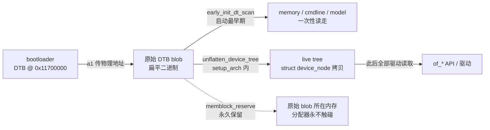

# DTB 生命周期与布局分析（S3 设计依据）

> 日期：2026-08-25 · 源码：`/home/developer/linux-7.2`（linux 7.2）· 关联：S3 开工设计、`QEMU-virt-DTB参考.md`
> 一句话结论：DTB 解析完之后，数据确实没用了；但内核会把 DTB 所在内存**永久保留**（memblock reserve），正常路径不会被覆盖。

## 问题

S3 开工前用户问：DTB 放 PSRAM 顶部，内核解析完之后是不是就没用了、可以被其他程序覆盖掉？

直觉里「解析完就没用」对了一半；「可以被覆盖」错了一半。差别在于两件事：**数据生命周期**（没用了）和**内存生命周期**（内核保留、不回收）。



## 分析过程（可复现）

从「内核到底怎么用 DTB」问起，顺 `setup_arch()` 往下追。

### 1. 内核怎么读 DTB：两次「解析」，各管一段

RISC-V 的 DTB 消费分两段（`arch/riscv/kernel/setup.c`）：

- **扁平扫描**：`parse_dtb()`（setup.c:255）→ `early_init_dt_scan()`，线性扫原始 blob，只取启动必需的几样：memory 节点（告诉 memblock 内存有多大）、chosen（cmdline、stdout-path）、machine model。这一步发生在内存管理可用之前。
- **展开拷贝**：`setup_arch()` 后段（setup.c:329-331）调 `unflatten_device_tree()`，把原始 blob 展开成一棵 `struct device_node` 树，**拷贝**到内核自己分配的内存（`of_root` 指向新树）。此后所有驱动、`of_*` API 读的都是这棵拷贝，原始 blob 不再被读。

所以「解析完就没用了」在数据层面成立——准确说法是：**unflatten 之后，原始 blob 只是没人读，内核并没有把它当垃圾回收。**

### 2. 内核为什么不会覆盖它：setup_bootmem() 显式保留

`arch/riscv/mm/init.c` 的 `setup_bootmem()`（init.c:217），被 `paging_init()`（init.c:1350）无条件调用（MMU / NOMMU 共用；noMMU 下 `dtb_early_va` 就是物理地址本身，init.c:1309）。里面有这一行（init.c:307）：

```c
if (!IS_ENABLED(CONFIG_BUILTIN_DTB))
    memblock_reserve(dtb_early_pa, fdt_totalsize(dtb_early_va));
```

含义：按 `fdt_totalsize`（整块 DTB 大小）把这块物理内存从 memblock 的可用内存里划走。memblock 之后变成伙伴分配器，被 reserve 的区域不会变成 free page——所以内核自己（页表、kmalloc、给用户进程的内存）都不会落在 DTB 上。

`CONFIG_BUILTIN_DTB=y` 时不保留：DTB 编译进内核镜像，本来就在 rodata，属于内核镜像保留区，不需要单独划。

### 3. 边界（哪里会坏）

- 故意直接写物理地址（如 `/dev/mem` 这类绕开分配器的路径）可以覆盖它——但那不是「被其他程序正常覆盖」。
- 前提：DTB 地址必须在 memory 节点声明的范围内（我们的是 0x11000000~0x11800000），保留才有意义。
- bootloader 提供的 DTB 必须 `fdt_totalsize` 正确，否则内核保留的大小不对（dtc 编译出来的 .dtb 自带正确值，不用手工算）。

## S3 布局决策（2026-08-25 用户拍板）

- 内核 Image @ `0x11000000`（沿用 S1 跳转地址；rv32 要求 4MB 对齐，满足）
- DTB @ `0x11700000`（PSRAM 顶部附近；8MB 结束于 0x11800000，给内核和数据留足空间）
- 跳转协议：a0 = hartid，**a1 = DTB 物理地址（不再是 NULL）**——真内核必须有 DTB
- 分区：FAKE 64K → 3M（`partition_table.json`），bootloader 拷贝长度按分区实际大小算，不再写死 4096；后续内核变大只改分区
- 代价：PSRAM 顶部几 KB 永久保留（最小 DTB 约 1~2KB，8MB 里可忽略）

## 参考

- `arch/riscv/kernel/setup.c`（parse_dtb / setup_arch / unflatten_device_tree）
- `arch/riscv/mm/init.c`（setup_bootmem / paging_init / memblock_reserve）
- `notes/QEMU-virt-DTB参考.md`（S3 最小 DTB 的形状来源）
