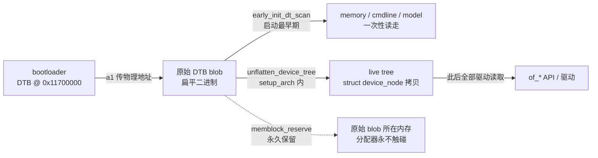

# DTB 生命周期与布局分析（S3 设计依据）

> 日期：2026-08-25 · 源码：`/home/developer/linux-7.2`（linux 7.2）· 关联：S3 开工设计、`QEMU-virt-DTB参考.md`
> 一句话结论：DTB 解析完之后，数据确实没用了；但内核会把 DTB 所在内存**永久保留**（memblock reserve），正常路径不会被覆盖。

## 问题

S3 开工前用户问：DTB 放 PSRAM 顶部，内核解析完之后是不是就没用了、可以被其他程序覆盖掉？

直觉里「解析完就没用」对了一半；「可以被覆盖」错了一半。差别在于两件事：**数据生命周期**（没用了）和**内存生命周期**（内核保留、不回收）。



## 分析过程（可复现）

从「内核到底怎么用 DTB」问起，顺 `setup_arch()` 往下追。

### 1. 内核怎么读 DTB：两次「解析」，各管一段

RISC-V 的 DTB 消费分两段（`arch/riscv/kernel/setup.c`）：

- **扁平扫描**：`parse_dtb()`（setup.c:255）→ `early_init_dt_scan()`，线性扫原始 blob，只取启动必需的几样：memory 节点（告诉 memblock 内存有多大）、chosen（cmdline、stdout-path）、machine model。这一步发生在内存管理可用之前。
- **展开拷贝**：`setup_arch()` 后段（setup.c:329-331）调 `unflatten_device_tree()`，把原始 blob 展开成一棵 `struct device_node` 树，**拷贝**到内核自己分配的内存（`of_root` 指向新树）。此后所有驱动、`of_*` API 读的都是这棵拷贝，原始 blob 不再被读。

所以「解析完就没用了」在数据层面成立——准确说法是：**unflatten 之后，原始 blob 只是没人读，内核并没有把它当垃圾回收。**

### 2. 内核为什么不会覆盖它：setup_bootmem() 显式保留

`arch/riscv/mm/init.c` 的 `setup_bootmem()`（init.c:217），被 `paging_init()`（init.c:1350）无条件调用（MMU / NOMMU 共用；noMMU 下 `dtb_early_va` 就是物理地址本身，init.c:1309）。里面有这一行（init.c:307）：

```c
if (!IS_ENABLED(CONFIG_BUILTIN_DTB))
    memblock_reserve(dtb_early_pa, fdt_totalsize(dtb_early_va));
```

含义：按 `fdt_totalsize`（整块 DTB 大小）把这块物理内存从 memblock 的可用内存里划走。memblock 之后变成伙伴分配器，被 reserve 的区域不会变成 free page——所以内核自己（页表、kmalloc、给用户进程的内存）都不会落在 DTB 上。

`CONFIG_BUILTIN_DTB=y` 时不保留：DTB 编译进内核镜像，本来就在 rodata，属于内核镜像保留区，不需要单独划。

### 3. 边界（哪里会坏）

- 故意直接写物理地址（如 `/dev/mem` 这类绕开分配器的路径）可以覆盖它——但那不是「被其他程序正常覆盖」。
- 前提：DTB 地址必须在 memory 节点声明的范围内（我们的是 0x11000000~0x11800000），保留才有意义。
- bootloader 提供的 DTB 必须 `fdt_totalsize` 正确，否则内核保留的大小不对（dtc 编译出来的 .dtb 自带正确值，不用手工算）。

## S3 布局决策（2026-08-25 用户拍板）

- 内核 Image @ `0x11000000`（沿用 S1 跳转地址；rv32 要求 4MB 对齐，满足）
- DTB @ `0x11700000`（PSRAM 顶部附近；8MB 结束于 0x11800000，给内核和数据留足空间）
- 跳转协议：a0 = hartid，**a1 = DTB 物理地址（不再是 NULL）**——真内核必须有 DTB
- 分区：FAKE 64K → 3M（`partition_table.json`），bootloader 拷贝长度按分区实际大小算，不再写死 4096；后续内核变大只改分区
- 代价：PSRAM 顶部几 KB 永久保留（最小 DTB 约 1~2KB，8MB 里可忽略）

## 内核怎么知道内存有多大：memory 节点是唯一来源

### 问题

bootloader 跳转内核后，内核怎么知道可用内存多大、范围从哪到哪？

### 结论

内核**不探测内存，只信 DTB 的 `/memory` 节点**。bootloader 的 a1 只告诉内核 DTB 在哪个地址；内存范围是 DTB 的内容，不通过寄存器参数传。

### 分析过程（可复现）

1. **读 memory 节点**：`parse_dtb()` → `early_init_dt_scan()` → `early_init_dt_scan_memory()`（`drivers/of/fdt.c:1036`）。扫 DTB 根下所有 `device_type = "memory"` 的节点，读 `reg` 属性的 `(base, size)` 对。
2. **登记 memblock**：每条调 `early_init_dt_add_memory_arch(base, size)` → 最终 `memblock_add(base, size)`（`fdt.c:1158` 结尾）。RISC-V 没覆盖这个弱函数，用通用版。
3. **算范围、减保留区**：`setup_bootmem()`（`arch/riscv/mm/init.c:217`）→ `phys_ram_base = memblock_start_of_DRAM()`、`phys_ram_end = memblock_end_of_DRAM()`；再划掉内核镜像（init.c:237）、DTB（init.c:307）、initrd、reserved-memory，剩下才是可分配页。

### 具体到我们的板子（S3 的 DTB 要写）

```dts
memory@11000000 {
    device_type = "memory";
    reg = <0x11000000 0x00800000>;
};
```

内核看到就认为物理内存是 `[0x11000000, 0x11800000)` 共 8MB，再自己扣掉内核镜像和 DTB。

### 证据与坑

- 证据：S2 QEMU 日志 `Normal [mem 0x0000000080000000-0x0000000087ffffff]` = 启动参数 `-m 128M`，来源就是 QEMU 自动生成的 memory 节点。
- 坑：memory 节点写错，内核就以为内存是错的（base 写偏，PSRAM 起点就偏）；漏写可能直接起不来。这是「内核知道有 PSRAM」的唯一入口，S3 写 DTB 时第一优先级。
- 边界：rv32 的物理地址上限是 32 位（`MAX_MEMBLOCK_ADDR = ~0`），0x11000000 没有溢出问题。

## bootloader 死后，SRAM / SCRATCH / XIP_RAM 怎么处理

### 问题

bootloader 在 flash 上 XIP 执行、跳转后就死了；主 SRAM 512KB、XIP_RAM 16KB、SCRATCH_X/Y 各 4KB 这些内存，内核能使用吗？需要处理吗？

### 结论

- bootloader 跳转后确实「死了」：代码不再执行，留在 SRAM 的栈/数据随之作废；但死 ≠ 自动交给内核——内核认内存的唯一渠道还是 DTB 的 memory 节点，没声明的地方对内核就是「不存在」，无需处理。
- S3 只声明 PSRAM（`0x11000000` 8MB）；其余内存全部不声明、自动闲置。

### 这些块是什么（先纠正认知）

- 520KB 主 SRAM 是一整块连续的 `0x20000000`–`0x20081FFF`：前 512KB 是普通 RAM，最后 8KB 就是 SCRATCH_X（0x20080000，4KB）+ SCRATCH_Y（0x20081000，4KB）——同一块 SRAM 的尾巴，SDK 单独命名是 bootrom/调试器习惯用途（pico-sdk `default_locations.ld`）。
- XIP_RAM 16KB @ `0x13FFC000` 不是普通 SRAM，是 cache-as-SRAM 窗口：RP2350 用 pin 缓存行实现「缓存当 RAM」（手册 4.4.1.3；bootrom 也在 0x13ffc000-0x14000000 找 RAM 镜像）。语义特殊，不是即插即用内存。

### 为什么 S3 不用（三个理由）

1. 非连续内存是墙：PSRAM（0x11000000）和 SRAM（0x20000000）间隔约 232MB 空洞；noMMU + FLATMEM 页框连续编号，空洞需要 pfn_valid 处理——值得单独实验，不跟 S3 混变量。
2. XIP_RAM 特殊：pin 缓存行、与 XIP 缓存互相影响、pico-sdk 有专门 xip_ram 链接脚本。
3. 收益小：8MB PSRAM 足够内核 + 后续 rootfs；SCRATCH 8KB / 缓存窗口 16KB 对 Linux 是蚊子腿。

### SRAM 的未来价值（为什么现在闲置 ≠ 永远没用）

RP2350 的 AMO / lr-sc 原子操作只支持 SRAM，PSRAM 上触发 Store/AMO Fault（手册 MCAUSE CODE 7，见 PLAN.md 硬件墙）。以后内核跑到自旋锁/原子变量可能撞墙，届时 SRAM 是「放需要原子操作的数据」的候选地（S4/S5 的事）。

## 启动代码在 PSRAM 上执行有没有问题（S3 知识储备）

### 结论

`_start` → `start_kernel` 之前的启动代码在 PSRAM 上执行**没有原则性的正确性问题**；确定的代价只是慢。真正会咬人的 AMO 墙在 start_kernel 之后。

### 为什么没问题：两个硬件事实

1. **XIP 缓存对同一 hart 自洽**：RP2350 的 XIP 缓存是写回缓存（行状态含 Dirty），但对同一个 hart 自己的写 → 读/取指是自洽的——脏行会服务自己的后续访问。手册原话：「正常操作软件不需要考虑缓存一致性，除非做 flash 编程」（4.4.1）。bootloader 把内核写进 PSRAM、再跳到 PSRAM 取指，同一个 hart，缓存自己兜得住。
2. **fence.i 不管缓存也够用**：Hazard3 没有 store buffer，假设顺序一致，`fence` 是 NOP；`fence.i` 只清 BTB + 跳 pc+4 清预取缓冲（手册 3.8.1.21），不 flush XIP 缓存——但恰好不需要。

### 启动代码在 PSRAM 上具体干了什么（对照 head.S:210）

- 关中断、`fence.i`、`reset_regs`、PMP 设置——全是核内 CSR 操作，跟内存介质无关。
- 清 .bss——写 PSRAM，走缓存窗口，同 hart 自洽。
- 搭栈——sp 指向内核镜像里的 `init_thread_union`（PSRAM），慢但正确。
- mtvec 指向 `.Lsecondary_park`（PSRAM 地址）——执行来自 PSRAM 没问题。
- 全程没有 AMO/lr-sc，所以「PSRAM 不支持原子操作」这堵墙在 start_kernel 之前不会撞上。

### 两个交接边界（真正要小心的）

1. **拷贝路径与缓存状态一致**：S1 验证过的模式（缓存窗口写 → 读回校验 → 跳转）是安全模式。别改成 DMA 或 uncached 窗口写完直接跳——虽然启动时 bootrom 已把所有缓存行 invalid 过一遍，风险很低，但读回校验是免费兜底。反过来，如果拷贝走缓存窗口，跳转前**不要**做 invalidate（会把还没写回的脏数据丢掉）。
2. **性能**：每条指令取指都过 QMI，启动比 SRAM 慢不少，单次成本；QMI 时钟由 bootloader 配置（S1 已验证）。

### 交接卫生

中断已关（S1 的 disable irqs）；看门狗如果用了要在跳转前停（pico-sdk 默认不开）；PSRAM 保持 bootloader 初始化好的状态，内核早期不碰 QMI。

### start_kernel 之后的墙（预告）

- 第一个自旋锁触发 AMO（ticket spinlock）→ PSRAM 上 Store/AMO Fault——S3/S4 要亲手撞的墙（PLAN.md 硬件墙）。
- 文本补丁（alternatives）写 PSRAM 走缓存窗口、同 hart 自洽，大概率没事，但值得观察。

## earlycon 机制：S3 出字的关键（知识储备）

### 问题

bootloader 跳转内核后要看日志，需要在 cmdline 里设 `earlycon=pl011,...`；earlycon 在哪解析、怎么打印、没有 `console=ttyX` 会怎样？

### cmdline 形式

`earlycon=pl011,mmio32,0x40070000,115200n8`，放 DTB `chosen/bootargs`（裸 `earlycon` 走 stdout-path，显式写地址更可控）。`mmio32` 让 pl011 earlycon 用 32 位寄存器访问（amba-pl011.c:2818）。

### 解析链（在哪被解析）

1. `early_param("earlycon", param_setup_earlycon)`（earlycon.c:249）——所有 early_param 由 `parse_early_param()` 触发，在 `setup_arch()` 里、`early_ioremap_setup()` 之后。
2. `setup_earlycon()` 拿名字匹配 `__earlycon_table`（链接器收集的 EARLYCON_DECLARE 表）；pl011 条目 `OF_EARLYCON_DECLARE(pl011, "arm,pl011", pl011_early_console_setup)`（amba-pl011.c:2843）。
3. `register_earlycon()`：解析 io 类型/地址/波特率 → `earlycon_map(addr, 64)` → setup 把 write 钩子设为 `pl011_early_write` → `register_console()`。
4. 地址映射：noMMU 的 `ioremap` 是恒等映射（asm-generic/io.h NOMMU 分支直接返回物理地址）→ 直接读写 0x40070000，不涉及页表。本构建 `CONFIG_FIX_EARLYCON_MEM` 未开，走 ioremap。

### 打印链（怎么打印）

- earlycon 注册成标准 console：名字固定 `pl011`，flags = `CON_PRINTBUFFER | CON_BOOT`（earlycon.c:31）。
- printk 路径：环形缓冲 → `console_unlock()` → 遍历 console 列表 → 逐个 `write`。
- write = `pl011_early_write` → 逐字符 `pl011_putc`：轮询 TXFF → 写 `UART01x_DR` → 轮询 BUSY（amba-pl011.c:2760）。纯轮询、不依赖中断，所以早启动可用。
- `CON_PRINTBUFFER`：注册时回放日志缓冲，所以比 earlycon 更早的 "Linux version" banner 也会补打出来（S2 日志 0.000000 时刻可见）。

### 没有 console=ttyX 会怎样

- earlycon 是 boot console（CON_BOOT）。printk.c 规则：一旦注册真 console，所有 boot console 自动注销；真 console 注册后 boot console 再注册被拒（printk.c:4051 注释 + 代码）。
- pl011 真 console（ttyAMA0）在驱动 **probe 成功**时注册（`uart_add_one_port` → `register_console`）；probe 需要 serial 节点 + **时钟**（`pl011_probe` 里 `devm_clk_get` 失败直接返回错误，amba-pl011.c:3039）。
- 情况 A：serial 节点 + clocks 齐 → 真 console 注册（无 console= 也走 `try_enable_default_console`）→ earlycon 自动注销，日志由 ttyAMA0 接管。
- 情况 B：probe 失败 → 没有真 console → earlycon 常驻，日志一直从 earlycon 出。
- 证据：S2 QEMU 日志三行——`bootconsole [uart8250] enabled` → `ttyS0 ... enabled` → `bootconsole [uart8250] disabled`。另有 `keep_bootcon` 可强制保留。

### S3 两个观察点

1. 第一级：只要 `earlycon=...` 就能出字（纯轮询寄存器，不依赖驱动）。
2. 第二级：`console=ttyAMA0` 真 console 接管，需要 serial 节点 + clocks（fixed-clock），日志出现 `ttyAMA0 enabled` + `bootconsole disabled`。建议 cmdline 两个参数都带。

## 只给 earlycon、不给 timer/clk/interrupt 时挂在哪（S3 预期依据）

### 结论：会挂，三个不同死点，取决于漏掉哪个节点

1. **缺 `riscv,cpu-intc`**（CPU 本地中断控制器，挂在 `/cpus/cpu@0/interrupt-controller`）→ `init_IRQ()` 直接 panic：`No interrupt controller found.`（arch/riscv/kernel/irq.c，`handle_arch_irq` 由 riscv-intc 设置）。注意：这是每个 CPU 都有的本地 intc，不是 XH3IRQ；XH3IRQ 缺了只是外设中断不工作，不 panic。
2. **缺 `timebase-frequency`**（`/cpus` 属性）→ `time_init()` 直接 panic：`RISC-V system with no 'timebase-frequency' in DTS`（arch/riscv/kernel/time.c）。
3. **有 timebase-frequency 但无任何 timer 节点** → 不 panic：`lpj_fine = riscv_timebase / HZ` 使 `calibrate_delay()` 走 "skipped, value calculated using timer frequency" 跳过；但没有 clockevent → 没有 tick → **jiffies 永远不前进** → 第一个需要超时/睡眠的代码（`msleep` / `schedule_timeout` / 带超时 `wait_for_completion`）永久挂住。具体挂点无法提前确定，最后一行日志就是证据。
4. **缺 clk** → 不致命：pl011 真 console 的 probe 因 `devm_clk_get` 失败而失败/延迟，earlycon 继续工作，boot 不因此挂。

### 顺序（init/main.c）

```
init_IRQ()          ← 缺 riscv,cpu-intc → panic "No interrupt controller found."
time_init()         ← 缺 timebase-frequency → panic "RISC-V system with no 'timebase-frequency' in DTS"
sched_clock_init()
calibrate_delay()   ← 有 timebase 则跳过；无 clockevent → 后面某处永久挂
```

### 对 S3 的含义

- 最小 DTB 必须含 `/cpus`（`timebase-frequency` + `riscv,cpu-intc`），这是不 panic 的前提，不算 timer/interrupt 部件。
- 即使齐了这些、不给 timer 节点和 XH3IRQ，预期现象：banner + 内存信息出完后挂在某个时间相关点。panic 消息也走 earlycon，所以死因可见。
- **timer 与 interrupt 在 tick 上是绑定的**：clockevent 靠中断驱动，MTIMECMP → XH3IRQ → riscv-intc 整条链缺一环 jiffies 都不动（S4/S5 实际应合并成一步 bring-up）。

## 参考

- `arch/riscv/kernel/setup.c`（parse_dtb / setup_arch / unflatten_device_tree）
- `arch/riscv/mm/init.c`（setup_bootmem / paging_init / memblock_reserve）
- `arch/riscv/kernel/head.S`（_start_kernel：关中断 / fence.i / reset_regs / PMP / 清 bss / 搭栈）
- `arch/riscv/kernel/irq.c`（init_IRQ：无 irqchip → panic）
- `arch/riscv/kernel/time.c`（time_init：无 timebase-frequency → panic；lpj_fine 跳过校准）
- `init/main.c`（init_IRQ → time_init → sched_clock_init → calibrate_delay 顺序）
- `init/calibrate.c`（calibrate_delay 跳过/收敛路径）
- `drivers/irqchip/irq-riscv-intc.c`（riscv,cpu-intc 注册 handle_arch_irq）
- `drivers/tty/serial/earlycon.c`（early_param / setup_earlycon / register_earlycon / earlycon_map）
- `drivers/tty/serial/amba-pl011.c`（OF_EARLYCON_DECLARE / pl011_early_write / pl011_probe 时钟要求）
- `kernel/printk/printk.c`（register_console：boot console 注销规则 / try_enable_default_console）
- `rp2350-datasheet.txt` 4.4.1（XIP 缓存写回、同 hart 自洽）、3.8.1.21（fence.i 只清 BTB/预取缓冲）
- `notes/QEMU-virt-DTB参考.md`（S3 最小 DTB 的形状来源）
