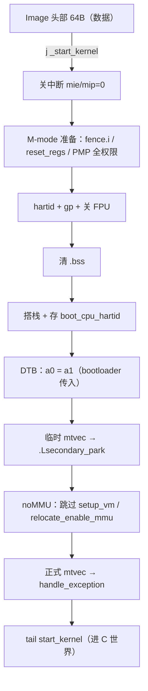

# RISC-V 内核启动详解：从 _start 到 start_kernel

> 适用配置：riscv32 + noMMU + M-mode + 单核（本项目 S2 的内核配置）。
> 主源码：`/home/developer/linux-7.2/arch/riscv/kernel/head.S`（配套 `head.h`、`include/asm/image.h`）。建议对着源码读本文。

## 0. 全景



一句话：`_start` 只做「环境准备」——关中断、清寄存器、开 PMP 全权限、刷指令缓存、清 .bss、搭栈、拿 DTB 地址、设异常入口——然后全部交给 C 的 `start_kernel`。

## 1. Image 头部（64 字节，是数据不是代码）

`head.S` 开头（省略 EFI 分支）：

```asm
__HEAD
SYM_CODE_START(_start)
	/* jump to start kernel */
	j _start_kernel          # 第一条指令：跳过下面的头部字段
	.word 0
	.balign 8
#ifdef CONFIG_RISCV_M_MODE
	/* Image load offset (0MB) from start of RAM for M-mode */
	.dword 0
#else
	.dword 0x400000          # 非 M 模式 rv32：4MB 偏移
#endif
	.dword _end - _start      # 镜像大小
	.dword __HEAD_FLAGS
	.word RISCV_HEADER_VERSION
	...
	.ascii RISCV_IMAGE_MAGIC  # "RISCV"
	.ascii RISCV_IMAGE_MAGIC2 # "RSC\x05"
```

结构定义在 `arch/riscv/include/asm/image.h`（`struct riscv_image_header`）：`code0`（可执行代码，就是那条 `j`）、`text_offset`、`image_size`、`flags`、`version`、`magic`、`magic2`。bootloader 读头部拿信息，但**跳到 Image 起始地址执行**（即 `_start` 处）。我们编译出的 Image 头部（`xxd -l 64 Image`）末尾正是 `5249 5343 56...` = "RISCV" + `5253 4305` = "RSC\x05"，对得上。

## 2. `_start_kernel`：关中断

```asm
SYM_CODE_START(_start_kernel)
	csrw CSR_IE, zero   # mie = 0：屏蔽所有中断
	csrw CSR_IP, zero   # mip = 0：清挂起中断
```

启动期间不允许任何中断插进来，全部关掉。

## 3. M-mode 特有准备（没有固件替我们做）

### 3.1 刷指令缓存

```asm
	fence.i
```

M 模式没有 OpenSBI/固件帮我们做启动清理；`fence.i` 保证自修改代码（比如 .rela.dyn 修补）后 I-cache 一致。

### 3.2 清空寄存器

```asm
	call reset_regs
```

`reset_regs`（head.S 尾部）：除了 `ra/a0/a1`（返回地址、hartid、DTB）外，所有 GPR 清零；`CONFIG_FPU` 时还会把 f0-f31 和 fcsr 清零。起点干净，调试时没有脏寄存器干扰。

### 3.3 PMP：给自己开全权限

```asm
	la a0, .Lpmp_done        # 临时 trap handler：不支持 PMP 的机器直接跳过
	csrw CSR_TVEC, a0
	li a0, -1
	csrw CSR_PMPADDR0, a0    # 覆盖整个地址空间
	li a0, (PMP_A_NAPOT | PMP_R | PMP_W | PMP_X)
	csrw CSR_PMPCFG0, a0
.Lpmp_done:
```

M 模式没有固件帮我们配 PMP，内核自己把 region0 设成 NAPOT + 读/写/执行全权限——否则访问内存/外设会触发 PMP fault。

## 4. 公共路径

### 4.1 hartid

```asm
#ifdef CONFIG_RISCV_M_MODE
	csrr a0, CSR_MHARTID    # M 模式：自己读
#else
	# S 模式：直接用 a0 里 bootloader 传的值
#endif
```

### 4.2 加载全局指针

```asm
	load_global_pointer      # gp = PC 相对算出的 __global_pointer$
```

内核用 `gp` 做小数据快速寻址（`gp` 相对访存），PC 相对算出，随运行地址自动正确。

### 4.3 关 FPU/向量

```asm
	li t0, SR_FS_VS
	csrc CSR_STATUS, t0      # 清 mstatus 的 FS/VS 位
```

内核代码不该用浮点/向量；关掉后一旦用了会触发异常，主动暴露 bug。

### 4.4 清 .bss

```asm
	/* Clear BSS for flat non-ELF images */
	la a3, __bss_start
	la a4, __bss_stop
	ble a4, a3, .Lclear_bss_done
.Lclear_bss:
	REG_S zero, (a3)
	add a3, a3, RISCV_SZPTR
	blt a3, a4, .Lclear_bss
.Lclear_bss_done:
```

和 ARM 裸机清 .bss 同一个动作：启动早期自己清零（bootloader 不做这事）。

### 4.5 存 boot_cpu_hartid + 搭栈

```asm
	la a2, boot_cpu_hartid
	REG_S a0, (a2)              # 记录主 hartid

	la tp, init_task
	la sp, init_thread_union + THREAD_SIZE
	addi sp, sp, -PT_SIZE_ON_STACK
```

`tp` 指向第一个任务（init_task），`sp` 指向它的内核栈顶——C 世界的第一块栈。

### 4.6 DTB 地址

```asm
#ifdef CONFIG_BUILTIN_DTB
	la a0, __dtb_start
#else
	mv a0, a1                  # a1 来自 bootloader（RISC-V 协议）
#endif
```

没有内置 DTB 时，直接用 bootloader 传进来的 a1——这就是为什么 bootloader 跳转时必须传对 DTB 地址（S1 假镜像传 NULL 可以，真内核不行）。

### 4.7 临时 trap vector

```asm
	la a3, .Lsecondary_park
	csrw CSR_TVEC, a3          # 早期异常就停在这：wfi + j 死循环
```

调试锚点：`setup_trap_vector` 完成前如果出异常，PC 会停在 `.Lsecondary_park`——gdb 一看就知道是早期启动挂了。

### 4.8 noMMU：跳过页表部分

```asm
#ifdef CONFIG_MMU
	call setup_vm
	la a0, early_pg_dir
	call relocate_enable_mmu
#endif
```

我们是 noMMU，`setup_vm` / `relocate_enable_mmu`（建页表、开虚拟内存）整体跳过——这正是「noMMU 内核不需要页表重定位」在代码里的位置。

### 4.9 正式 trap vector

```asm
.Lsetup_trap_vector:
	la a0, handle_exception
	csrw CSR_TVEC, a0          # mtvec = 真正的异常入口
	csrw CSR_SCRATCH, zero     # 标记「当前在内核态」
	ret
```

### 4.10 进 C 世界

```asm
	scs_load_current            # 影子调用栈（CFI 支持，7.x）
	call soc_early_init         # 架构早期钩子
	tail start_kernel          # 跳过去，不返回
```

`tail` = 不保存返回地址的跳转，`start_kernel` 之后就是 C 的世界（init/main.c）。

## 5. 和 ARM 裸机启动对照

| 步骤 | ARM 裸机 | RISC-V 内核 |
|---|---|---|
| 入口 | reset 向量 → `_start` | `_start` → `j _start_kernel` |
| 关中断 | 写 CPSR/掩码 | `csrw mie/mip, zero` |
| 特权准备 | 无对应（CPU 自带） | PMP 全权限 + fence.i + reset_regs |
| 清 BSS | 循环清零 | `head.S` 同款循环 |
| 搭栈 | sp 指向 RAM 顶部 | `init_thread_union + THREAD_SIZE` |
| 硬件描述 | 无/硬编码 | DTB（a1 传入） |
| 异常入口 | 设向量表 | 两段式：临时 .Lsecondary_park → 正式 handle_exception |
| 跳主函数 | `bl main` | `tail start_kernel` |

## 6. 调试提示

- 早期异常（setup_trap_vector 之前）→ PC 停在 `.Lsecondary_park`（wfi 死循环）；
- 进了 start_kernel 但没输出 → 看 `earlycon`（最早期串口）是否工作；
- 一条日志都没有 → 先查 bootloader 跳转参数（a0/a1）、加载地址对齐（rv32 4MB）、DTB 是否可读。

> 本文是 S2 复盘文「从 _start 到 start_kernel」的详细版，真机日志见 `实验日志/2026-08-21_S2_QEMU首跑.md`。
