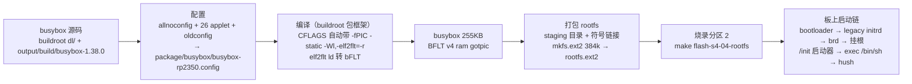

# busybox 移植与 rootfs 打包流程（S4-04）

> 从 busybox 源码到板子上敲命令的完整链路。核心约束：**内核只吃 bFLT**（NOMMU 无 ELF），rootfs 载体是 ext2（S4-02 起）。

## 一图流



## 两条工具链的分工（先分清谁编谁）

| 工具链 | 编什么 | 怎么出 bFLT |
|---|---|---|
| **buildroot 工具链**（`riscv32-buildroot-linux-uclibc-gcc` + uclibc-ng + elf2flt） | busybox | buildroot 包框架自动在 CFLAGS/LDFLAGS 注入 `-Wl,-elf2flt=-r -static`，链接时 elf2flt 的 ld 把 ELF 直接转成 bFLT |
| **系统工具链**（`riscv64-linux-gnu-gcc -nostdlib`） | 我们的 /init 启动器等手搓程序 | `scripts/pack-bflt.sh` 手搓（无重定位 bFLT，S3-05 起） |

> 关键认知：buildroot **内部工具链的 gcc wrapper 不会自动加 `-elf2flt`**（那是 external toolchain 的行为）；转换靠的是包框架的 CFLAGS/LDFLAGS 注入。所以我们脱离 buildroot 手编程序时，也要自己带 `-fPIC -static -Wl,-elf2flt=-r`（或走 pack-bflt.sh 的无重定位路线）。

## 分步流程

### 1. 源码从哪来

buildroot 构建时自动下载 busybox（`dl/` 缓存）并解压到 `output/build/busybox-1.38.0/`。**我们改配置、看源码都在这个目录里操作**。

### 2. 改配置（最小 applet 集）

目标：NOMMU 8MB RAM 下跑得动——busybox 必须小（连续内存约束，见下）。

```sh
cd output/build/busybox-1.38.0
make allnoconfig                          # 全部 applet 关掉
# sed 把要的 applet 置 y：BUSYBOX LS CAT ECHO MOUNT MKDIR RM CP MV DF PWD
#   TRUE FALSE SLEEP PS UNAME DMESG GREP SED HEAD TAIL CUT DATE DD CHMOD LN
yes "" | make oldconfig                   # 依赖项按默认补齐（非交互）
cp .config /home/developer/buildroot-2026.05.2/package/busybox/busybox-rp2350.config
```

把配置存进 buildroot 源码树后，在 buildroot `.config` 里改：

```sh
BR2_PACKAGE_BUSYBOX_CONFIG="package/busybox/busybox-rp2350.config"
```

这样以后 `make` 会自动用这份配置重编 busybox（可复现、随 buildroot git 提交）。

踩过的配置坑：
- **`CONFIG_LFS`**：allnoconfig 会关掉大文件支持，但 buildroot 的 CFLAGS 强制 `-D_FILE_OFFSET_BITS=64` → busybox 编译期断言 `off_t != uoff_t` 报错 → 手动补 `CONFIG_LFS=y`。
- **`ash` 在 NOMMU 上不存在**：busybox 1.38 的 `CONFIG_ASH` 是 `depends on !NOMMU`，NOMMU 下 shell 只能是 **hush**（kconfig 的 `sh` 别名 choice 会自动选它）。
- **buildroot 强制项**：`busybox.mk` 会强制开 `CONFIG_INIT`、hush 系列特性、MDEV 等（`KCONFIG_ENABLE_OPT`），配置文件里关不掉，接受即可。

### 3. 编译

```sh
cd /home/developer/buildroot-2026.05.2
make busybox-dirclean busybox     # 清旧构建目录 → 用新配置重编
```

buildroot 包框架自动注入：
`CFLAGS="-D_LARGEFILE_SOURCE ... -fPIC -Wl,-elf2flt=-r -static"`

产物：`output/target/bin/busybox`（**255KB，BFLT v4 ram gotpic**，26 个 applet）。

### 4. 打包 rootfs（ext2 镜像）

工程侧 `s4/04_busybox/` 的 Makefile：

```sh
make busybox-s4-04    # 把 output/target/bin/busybox 拷到工程目录
make image-s4-04      # 组 staging 目录 + mkfs.ext2 → rootfs.ext2
```

`image-s4-04` 内部做的事：
1. 建 `build/s4-04-root/{dev,bin,tmp,proc}`；
2. 放 `/init`（手搓 bFLT 启动器：dup3 tty → 挂 ramfs /tmp + proc /proc → exec /bin/sh）；
3. 放 `/bin/busybox`；
4. **建 26 个 applet 符号链接**：`ln -s busybox bin/ls`、`bin/cat`、`bin/sh`…… busybox 是单二进制，按 argv[0] 分派 applet；
5. `mkfs.ext2 -b 1024 -d staging rootfs.ext2 384k` → **384KB 真实 ext2 镜像**（分区 2 的烧录内容，raw 格式，不是 cpio）。

### 5. 烧录与启动链（板上）

```sh
make flash-s4-04-rootfs    # 内核/DTB/bootloader 不变时只需重烧这一条
```

启动链：
1. bootloader 把分区 2（rootfs.ext2）拷到 PSRAM `0x11300000`；
2. 内核 legacy initrd 链：认出 ext2 → 拷进 `/dev/ram0`（brd，配置 1MB 但只实际写入 384KB）→ mount 成根（只读）→ `init=/init`；
3. `/init`（手搓 bFLT）：把 tty dup3 成 0/1/2 → 挂 ramfs `/tmp`、proc `/proc` → `execve("/bin/sh", ["sh"])`；
4. `/bin/sh` 符号链接 → busybox → 按 argv[0] 分派成 **hush** → 交互 shell。

## 为什么要裁到 26 个 applet / 384KB（NOMMU 连续内存墙）

- 每个外部 applet（ls/cat/ps）都是把整份 busybox 当**新进程** exec，需要一整块连续物理内存；
- 旧 566KB 版本 exec 一次要 600KB（order-8 块），ash 占一份后装不下第二个 → `-ENOMEM` → 段错误；
- 裁到 255KB 后 exec 只要 256KB（order-6 块）；
- 镜像从 1MB 缩到 384KB，brd 只写 384KB，initrd 释放出来的 1MB 区域能留下 **512KB 连续块**，够 hush + 一个外部命令共存；
- 精细裁剪留给 S5（裁剪优化）。

## 排障速查

- 外部 applet 段错误 / `nommu: Allocation of length ... failed` / `page allocation failure: order:N` → 连续内存不够：裁 busybox 或缩镜像，或上 XIP（S5）。
- 编译期 `BUG_off_t_size_is_misdetected` → 补 `CONFIG_LFS=y`。
- 想改 applet 集 → 改 `busybox-rp2350.config`（或重跑 allnoconfig+sed），重编 busybox + 重建镜像。
- 提示符 `~` vs `/` → `FEATURE_EDITING_FANCY_PROMPT` 开关（`~` = 当前目录 == $HOME 的简写）。
