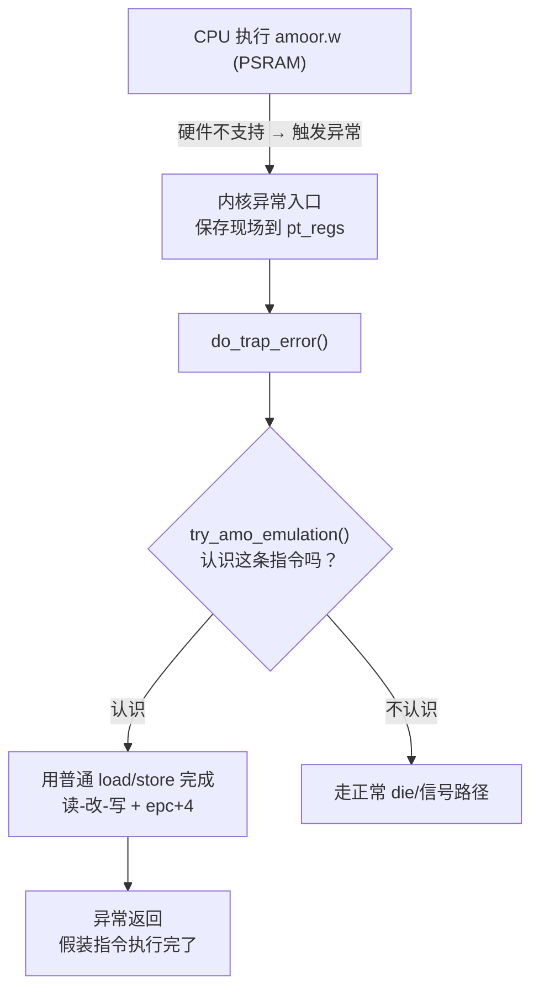

# 内核 AMO 模拟器详解（amo-emu.c 逐段教学）

> 写给"看得懂 C 和基础 RISC-V，但看到内核异常处理和位运算就头疼"的人。
> 读完你能回答四件事：**为什么需要这个模拟器**、**它怎么认出要模拟的指令**、**它怎么"假装"执行完一条原子指令**、**为什么这样是安全的**。
> 代码真源：`/home/developer/linux-7.2/arch/riscv/kernel/amo-emu.c`（S3-01 引入，S3-02 扩展使用）。

## 1. 先给一幅画面

正常 CPU 上，一条 `amoor.w` 由硬件原子完成：读旧值 → 按位或 → 写回，中间谁也不能插队。

RP2350 的 PSRAM 不支持硬件原子。内核偏要跑在 PSRAM 上，于是第一条原子操作就出事了。我们的对策是：**让硬件假装没看见，把指令交给软件来执行**。

具体流程：



一句话：**trap 路径被临时改造成一个"软件执行器"**。硬件做不了的原子指令，软件在异常处理里替它做完，再把程序计数器往后挪一条指令，假装无事发生。

## 2. 背景：RP2350 的 AMO 墙（硬件事实）

RISC-V 的原子指令分两类：

1. **AMO**（Atomic Memory Operation）：`amoadd.w`、`amoor.w`、`amoswap.w` 等，一条指令完成读-改-写。
2. **LR/SC**（Load-Reserved / Store-Conditional）：两条指令配合，`lr.w` 读并"预约"，`sc.w` 检查预约还在不在，在才写。

RP2350 手册 2.1.6：**Global Exclusive Monitor（全局排他监视器）只支持主 SRAM**。对 PSRAM 的原子访问有两种不同表现，非常关键：

| 指令 | 在 PSRAM 上的行为 | 后果 |
|---|---|---|
| AMO | 触发 Store/AMO Fault（mcause 6/7） | **会进异常** → 模拟器能拦住 |
| LR/SC | `lr.w` 正常读；`sc.w` 静默返回失败（不 fault） | **不进异常** → 模拟器根本看不到 → 死循环 |

第二条是 S3-01 撞得最疼的墙：内核把所有 LR/SC 循环当"有竞争，重试"，可 PSRAM 上它**永远**会失败，循环永不退出。这就是"静默失败"的可怕之处——不报错，就是转圈。

内核跑在 PSRAM 上，第一条原子操作在 `boot_cpu_init() → set_cpu_online()` 里（一个 `amoor.w`），早于任何打印，所以 S3-00 的现象就是"静默卡死，一个字节都不输出"。

## 3. 为什么必须"骗"指令走 AMO

既然 LR/SC 不 fault、模拟器够不着，那 Linux 内核里所有用 LR/SC 的地方都必须**换成会 fault 的 AMO**。S3-01 的补丁（`cmpxchg.h`）把 32 位 `cmpxchg` 强制改成 `amocas.w`（Zacas 扩展的"比较并交换"指令）：

- `amocas.w` 是 AMO 编码 → 会 fault；
- Hazard3 没有 Zacas 解码器 → 实际到异常时是**非法指令**（mcause 2）；
- 模拟器连 mcause 2 一起处理，把它当 AMO 模拟。

所以整个策略是：

> **把"不 fault 的 LR/SC"翻译成"会 fault 的 AMO"，让所有原子操作都从 trap 路径过一遍，由模拟器统一用普通 load/store 完成。**

## 4. RISC-V AMO 指令编码（位运算补课）

看不懂 `(insn >> 27) & 0x1f` 之前，先看懂 32 位指令长什么样。

一条 RISC-V 32 位指令是 4 个字节，从低位到高位分成几个字段：

```
31        27 26       25 24     20 19     15 14    12 11       7 6        0
+-----------+----------+---------+---------+--------+-----------+----------+
|  funct5   |  aq | rl |   rs2   |   rs1   | funct3 |    rd    |  opcode  |
+-----------+----------+---------+---------+--------+-----------+----------+
```

对 AMO 指令：

- `opcode`（bit 6:0）= `0101111`（十六进制 0x2f），所有 AMO/LR/SC 共用；
- `funct5`（bit 31:27）决定操作类型：00000=add、00001=swap、00010=lr、00011=sc、00101=amocas、00100=xor、01000=or、01100=and、10000=min、10100=max、11000=minu、11100=maxu；
- `funct3`（bit 14:12）决定数据宽度：`010` = 32 位（`.w`）、`011` = 64 位（`.d`）；
- `aq`/`rl`（bit 26:25）是内存顺序标志（acquire/release），模拟器直接忽略——单核无所谓；
- `rs1`、`rs2`、`rd` 是通用寄存器编号（0-31），x0 恒为 0。

拿 S3-00 撞墙的那条 `amoor.w a4, a3, (a5)` 举例，它的二进制拆解：

```
funct5=01000(8=or)  aq=0 rl=1  rs2=a3  rs1=a5  funct3=010(.w)  rd=a4  opcode=0x2f
```

模拟器要做的第一件事，就是从异常时保存的指令字节里把这些字段抠出来。

## 5. 源码逐段讲解

### 5.1 常量与全局状态

```c
#define AMO_OPCODE	0x2f
#define AMO_FUNCT5_AMOCAS	0x05	/* Zacas amocas.w */
#define PSRAM_BASE	0x11000000UL
#define PSRAM_SIZE	0x00800000UL
#define RES_GRANULE	16

static unsigned long emu_res_addr = ~0UL;
```

- `AMO_OPCODE`：识别"这是不是原子指令"的指纹；
- `PSRAM_BASE/SIZE`：模拟器只服务 PSRAM 窗口（0x11000000 起 8MB），窗口外的故障指令不碰；
- `emu_res_addr`：**软件版的 LR/SC 预约记录**。硬件用排他监视器记"哪个地址被预约了"，我们没有硬件，就用一个变量记。`~0UL` 表示"当前没有预约"。

### 5.2 reg_by_num：指令寄存器号 → 异常现场

异常发生时，CPU 把所有寄存器值存进一个 `pt_regs` 结构。指令里的 `rs1`、`rs2`、`rd` 是 5 位编号（0-31），`reg_by_num()` 就是把编号翻译成 `pt_regs` 里对应字段的地址：

```c
static unsigned long *reg_by_num(struct pt_regs *regs, unsigned int n)
{
	switch (n) {
	case 1:  return &regs->ra;
	case 2:  return &regs->sp;
	...
	case 10: return &regs->a0;
	...
	default: return NULL;	/* x0 */
	}
}
```

细节：**x0 返回 NULL**。RISC-V 的 x0 硬编码为 0，读它得 0、写它丢弃。返回 NULL 让调用方统一处理："读 x0 当 0，写 x0 不写"。

### 5.3 入口判断：什么异常才轮到我们

```c
bool try_amo_emulation(struct pt_regs *regs)
{
	...
	bool illegal = (regs->cause == EXC_INST_ILLEGAL);

	if (!illegal &&
	    regs->cause != EXC_STORE_MISALIGNED &&
	    regs->cause != EXC_STORE_ACCESS &&
	    regs->cause != EXC_STORE_PAGE_FAULT)
		return false;
```

`mcause`（Machine Cause）是异常原因寄存器。能进到这里处理的只有两类：

- **非法指令（cause 2）**：`amocas.w` 因为没有 Zacas 解码器，落在这里；
- **Store/AMO 类故障（cause 6/7/15）**：真正的 AMO 打在 PSRAM 上落在这里。

其他异常（比如缺页、断点）直接放行，不归我们管。

### 5.4 取指：半字拼装（最容易翻车的细节）

模拟器要执行这条指令，先得知道指令的二进制是什么。指令在 `mepc`（异常程序计数器）指向的地址，取出来：

```c
if (!addr_in_psram(regs->epc))
	return false;
{
	u16 lo = *(u16 *)regs->epc;
	u16 hi = *(u16 *)(regs->epc + 2);
	insn = (u32)lo | ((u32)hi << 16);
	if ((insn & 0x3) != 0x3)
		return false;	/* 16-bit compressed instruction */
}
```

为什么要拆成两个 16 位读而不是直接 `*(u32 *)mepc`？两个坑叠在一起：

1. **压缩指令（C 扩展）**：RISC-V 允许 16 位短指令。一条 32 位指令可能紧跟在一条 16 位指令后面，于是它的起始地址是 `4k+2`（2 字节对齐、4 字节不对齐）。
2. **RP2350 的非对齐读陷阱**（S3-01 撞过）：对非对齐地址做 32 位 load，Hazard3 不 fault 也不拆分，而是返回 `0xf0000000` 这种垃圾值。

所以安全做法是：读两个**必然 2 字节对齐**的半字，手动拼成 32 位。

拼好后检查最低 2 位：RISC-V 规定 16 位压缩指令的低 2 位**不是** `11`，而 32 位指令低 2 位**恒为** `11`（因为 32 位指令必须 4 字节对齐）。所以 `(insn & 0x3) != 0x3` 直接判定是压缩指令，AMO 不可能是压缩的，拒绝。

### 5.5 解码：抠字段

```c
if ((insn & 0x7f) != AMO_OPCODE)
	return false;

funct5 = (insn >> 27) & 0x1f;
rs1num = (insn >> 15) & 0x1f;
rs2num = (insn >> 20) & 0x1f;
rdnum  = (insn >> 7) & 0x1f;
```

对照第 4 节的字段图，这就是"右移 + 掩码"把各字段抠出来。`& 0x1f` 取低 5 位（因为寄存器编号 0-31 需要 5 位）。

对非法指令 trap，只接受 `amocas.w`：

```c
if (illegal && funct5 != AMO_FUNCT5_AMOCAS)
	return false;
```

意思：如果是非法指令进来的，但 funct5 不是 amocas，那这是别的非法指令（比如内核 bug），不该由模拟器背锅，放行让正常 die 路径报错。

### 5.6 目标地址与操作数

```c
r = reg_by_num(regs, rs1num);
addr = r ? *r : 0;
if (!addr_in_psram(addr))
	return false;

r = reg_by_num(regs, rs2num);
rs2 = r ? *r : 0;
```

`rs1` 里装的是目标内存地址，`rs2` 里装的是操作数。地址不在 PSRAM 窗口就拒绝——模拟器只做 PSRAM 的活，SRAM 上的 AMO 硬件本来就支持。

### 5.7 LR/SC 模拟

**lr.w（funct5=2）**：预约 + 读

```c
if (funct5 == 0x02) {			/* lr.w */
	old = *(volatile u32 *)addr;
	emu_res_addr = addr;
	if (rdnum)
		*reg_by_num(regs, rdnum) = old;
	regs->epc += 4;
	return true;
}
```

硬件语义：把地址的值读进 `rd`，并让排他监视器"记住"这个地址。软件版：读内存 → 把地址记进 `emu_res_addr` → 写 `rd`。

**sc.w（funct5=3）**：检查预约 + 条件写

```c
if (funct5 == 0x03) {			/* sc.w */
	if (emu_res_addr != ~0UL &&
	    (addr & ~(RES_GRANULE - 1)) == (emu_res_addr & ~(RES_GRANULE - 1))) {
		*(volatile u32 *)addr = rs2;
		val = 0;
	} else {
		val = 1;		/* reservation lost */
	}
	emu_res_addr = ~0UL;
	if (rdnum)
		*reg_by_num(regs, rdnum) = val;
	regs->epc += 4;
	return true;
}
```

硬件语义：如果"预约"还在，就把 `rs2` 写进内存、`rd` 得 0（成功）；预约丢了就不写、`rd` 得非 0（失败）。软件版照做。`RES_GRANULE=16` 是预约的粒度对齐（硬件按 16 字节块记预约，地址取整到 16 对齐再比）。

注意：不管成功失败，`sc.w` 都会**清掉预约**（写 `emu_res_addr = ~0UL`），和硬件一致。

### 5.8 amocas.w（cmpxchg 的基石）

```c
if (funct5 == AMO_FUNCT5_AMOCAS) {	/* amocas.w rd, rs2, (rs1) */
	unsigned long expected;
	unsigned long *rdp = reg_by_num(regs, rdnum);

	if (((insn >> 12) & 0x7) != 0x2)
		return false;

	expected = rdp ? *rdp : 0;
	old = *(volatile u32 *)addr;
	if (old == expected)
		*(volatile u32 *)addr = rs2;
	if (rdp)
		*rdp = old;
	regs->epc += 4;
	return true;
}
```

这是最精妙的一条。`amocas.w` 的 `rd` **同时是输入和输出**：

- 执行前 `rd` 装"期望值"（expected）；
- 执行后 `rd` 装"内存旧值"；
- 如果内存旧值 == 期望值，就把 `rs2` 写进内存。

模拟就是照抄：读 `rd` 当 expected → 读内存旧值 → 相等才写 `rs2` → `rd` 写回旧值。调用方（`cmpxchg`）拿返回值（旧值）和期望值比，相等说明交换成功——**这就是 compare-and-swap 的完整语义**。

`((insn >> 12) & 0x7) != 0x2` 是检查宽度必须是 `.w`（32 位）。rv32 没有 `.d` 变体（那是 64 位的事）。

### 5.9 普通 AMO 全家桶

```c
old = *(volatile u32 *)addr;
switch (funct5) {
case 0x00: val = old + rs2; break;				/* amoadd.w */
case 0x01: val = rs2; break;					/* amoswap.w */
case 0x04: val = old ^ rs2; break;				/* amoxor.w */
case 0x08: val = old | rs2; break;				/* amoor.w */
case 0x0c: val = old & rs2; break;				/* amoand.w */
case 0x10: val = min_t(s32, (s32)old, (s32)rs2); break;	/* amomin.w */
case 0x14: val = max_t(s32, (s32)old, (s32)rs2); break;	/* amomax.w */
case 0x18: val = min_t(u32, old, rs2); break;		/* amominu.w */
case 0x1c: val = max_t(u32, old, rs2); break;		/* amomaxu.w */
default:
	return false;
}
emu_clear_reservation(addr);
*(volatile u32 *)addr = val;
if (rdnum)
	*reg_by_num(regs, rdnum) = old;
regs->epc += 4;
return true;
```

每个 case 就是"旧值参与哪种运算"。两个容易看错的点：

1. **min/max 有符号和无符号两套**：`amomin`（有符号）用 `s32` 强转比较，`amominu`（无符号）用 `u32`。位模式相同但比较解释不同（比如 `0xffffffff` 有符号是 -1、无符号是 4294967295）。
2. **`emu_clear_reservation(addr)`**：硬件语义里，任何 AMO 写都会让之前的 LR 预约失效。软件版也要同步：如果这个地址和预约的地址在同一个 16 字节块内，就清掉预约。

### 5.10 epc += 4：模拟器怎么"假装"指令执行完

`regs->epc += 4` 贯穿所有分支。这是整个模拟器成立的关键：

异常返回时，CPU 会跳回 `mepc` 继续执行。如果不把 `mepc` 往后挪，CPU 会**再次执行同一条故障指令、再次进异常**——无限循环。`+4` 就是告诉 CPU："这条指令我已经帮你做了，你从下一条开始吧。"

这也是"模拟"和"真实执行"唯一的区别：指令的**效果**由软件完成，CPU 只是跳过了它。

## 6. 与 trap 路径的衔接（traps.c）

```c
static void do_trap_error(struct pt_regs *regs, int signo, int code,
	unsigned long addr, const char *str)
{
	if (try_amo_emulation(regs))
		return;
	...
	if (user_mode(regs))
		do_trap(regs, signo, code, addr);
	else {
		if (!fixup_exception(regs))
			die(regs, str);
	}
}
```

`do_trap_error` 是所有 Store/AMO 故障和非法指令的公共处理入口。模拟器钩在**最前面**：

- 返回 `true` = 模拟成功，直接 `return`，异常当没发生过；
- 返回 `false` = 不是我们的菜，走正常路径（用户态发信号、内核态 `die` 打印崩溃信息）。

`try_amo_emulation` 本身也内置多重保险（地址不在 PSRAM、funct5 不认识、宽度不对都返回 false），所以"误吞异常"的风险很低。

## 7. cmpxchg.h 的配合改动

模拟器只能处理**会 fault** 的指令。所以 `cmpxchg.h` 里 32 位 compare-and-swap 在 `CONFIG_RISCV_AMO_EMULATION` 下强制走 `amocas.w`，**绕开运行时的 Zacas 能力检查**（启动早期 hwcap 还没解析）：

```c
if (IS_ENABLED(CONFIG_RISCV_ISA_ZACAS) &&
    IS_ENABLED(CONFIG_TOOLCHAIN_HAS_ZACAS) &&
    (IS_ENABLED(CONFIG_RISCV_AMO_EMULATION) ||
     riscv_has_extension_unlikely(RISCV_ISA_EXT_ZACAS))) {
	... amocas.w ...
}
```

S3-02 又发现：**不只是 cmpxchg**。`arch_atomic_fetch_add_unless` 这类"条件原子操作"（`atomic_dec_and_test` 的底层）用 LR/SC 实现，在 PSRAM 上死循环。于是同样策略扩展：这 4 个操作在模拟器配置下改写为 `arch_cmpxchg`（amocas.w）循环。教训：**凡是会生成 LR/SC 的内核原子路径，在 PSRAM 上都危险，都得翻译成 AMO**。

## 8. 原子性为什么安全（三句话）

原子操作的意义是"读-改-写一气呵成"。软件用普通 load/store 分三步做，为什么不会被打断？

1. **单核**：`CONFIG_SMP=n`，没有第二个 CPU 同时操作同一块内存；
2. **M 模式 trap 关中断**：进异常时 `mstatus.MIE` 自动清零，中断被屏蔽，没有异步打断；
3. 所以"读旧值 → 算新值 → 写回"中间**不可能插进任何其他代码**，等价于原子。

如果以后开 SMP 或 S 模式，这套"trap 里裸 load/store"就不安全了，需要加锁。

## 9. 边界与已知限制

- **只模拟 PSRAM 窗口**（0x11000000-0x11800000）：SRAM 上的原子操作硬件支持，不需要模拟；窗口外 fault 的 AMO 走正常 `die()`。
- **LR/SC 预约是软件跟踪**：预约期间如果来了一个**普通 store**（非 sc.w），硬件会失效预约，软件版**不会**——单核下影响极小（S3-01 README 记录）。
- **rv32 只有 `.w`（32 位）**：64 位原子（`cmpxchg64`、`atomic64_t`，rv32 走 LR/SC 路径）**未收口**，S3-02 没撞到；将来撞到需要 amocas.d 模拟 + 64 位读写。
- **性能**：每次原子操作多一次完整异常往返（保存/恢复现场 + 软件执行），几百个周期级别。对启动阶段和低频原子操作完全可接受；高频热路径（如某些自旋锁）会有感。

## 10. 怎么验证它在工作

真板现象（S3-00 → S3-01 对照）：

1. **关闭模拟器**：内核第一条 `amoor.w` 在 PSRAM 上 fault，`mcause=7`、`mepc=amoor.w`，串口一个字都不出（GDB 抓到的现场）；
2. **打开模拟器**：异常被模拟器吞掉，启动继续，banner 打印出来。

调试手段：

- GDB 在 `try_amo_emulation` 下断点，单步看它解码、执行、`epc+4`；
- 反汇编内核确认 `cmpxchg` 生成了 `amocas.w`（而不是 `lr.w/sc.w`）：
  ```sh
  riscv64-linux-gnu-objdump -d build-rv32-02/vmlinux | grep -E 'amocas|lr\.w|sc\.w'
  ```
- 看 `dmesg`/串口有没有异常的 "Fault" 死循环迹象（正常情况模拟器是静默的，成功不打印）。

## 11. 如果你要扩展（给后来者）

要支持 64 位 `amocas.d`，需要：

1. 编码检查放宽：`funct3 == 0b011`（`.d`）+ rv64（或 rv32 的 Zacas 双字）；
2. 模拟 `(u64)` 读-比较-写，注意 64 位读在 rv32 上要拆两个 32 位读并处理进位；
3. `rd` 的 64 位期望值/旧值处理。

要支持更多指令（比如未来出现的 AMO 变体），照 5.9 的 switch 加 case + 运算即可。

## 12. 术语速查

| 术语 | 含义 |
|---|---|
| AMO | 原子内存操作指令（amoadd/amoor/...），一条完成读-改-写 |
| LR/SC | 预约读/条件写指令对，靠排他监视器实现原子 |
| mcause | 异常原因寄存器（2=非法指令，6/7/15=Store/AMO 类故障） |
| mepc | 异常程序计数器（故障/非法指令的地址），异常返回从这里继续 |
| pt_regs | 异常时保存的寄存器现场结构 |
| Zacas | RISC-V 的"比较并交换"扩展，指令是 amocas |
| 排他监视器 | 硬件记录"哪个地址被 LR 预约"的机制 |
| Reservation | 预约，LR 到 SC 之间的"内存地址占用权" |
