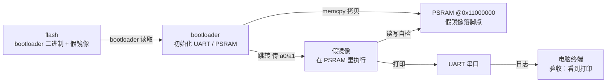

# S1 · 假镜像闭环

> 施工态 · 🚧 本阶段未通关，成文 / 钩子 / 自测通关时补

## 部件图（施工态）

图例：**粗框 = 要学透的部件（承重）**，细框 = 样板活（填充）。S1 从零起步，全图皆新。

## 决策清单（做到对应部件时再拍，先只挂问题）

- [x] 镜像在 flash 里怎么放 → **固定偏移**，以后镜像变复杂再换 picobin 分区表。理由：先聚焦闭环，简单优先。
- [x] PSRAM 片选脚 → **先按资料定死**，以后移植到其他板再改自动探测。理由：单板求稳。待落实：Waveshare RP2350 Plus 16MB 的资料（先试 GP47，实验读 ID 验证）。
- [x] 跳转参数 → **先按真内核协议占好 a0/a1**；「跳转」部件时把协议讲透。理由：为 S3 铺路，且用户要学透。
- [x] 烧录工具 → **picotool 为主，DAPLink / OpenOCD 也提供**。理由：picotool 新手友好。

## 要点段（要学透的部件验收后即时追加）

-（空）
