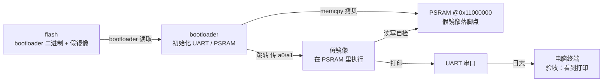

# S1 · 假镜像闭环

> 施工态 · 🚧 本阶段未通关，成文 / 钩子 / 自测通关时补

## 部件图（施工态）

图例：**粗框 = 要学透的部件（承重）**，细框 = 样板活（填充）。S1 从零起步，全图皆新。

## 决策清单（做到对应部件时再拍，先只挂问题）

- [x] 镜像在 flash 里怎么放 → **固定偏移**，以后镜像变复杂再换 picobin 分区表。理由：先聚焦闭环，简单优先。
- [x] PSRAM 片选脚 → **先按资料定死**，以后移植到其他板再改自动探测。理由：单板求稳。待落实：Waveshare RP2350 Plus 16MB 的资料（先试 GP47，实验读 ID 验证）。
- [x] 跳转参数 → **先按真内核协议占好 a0/a1**；「跳转」部件时把协议讲透。理由：为 S3 铺路，且用户要学透。
- [x] 烧录工具 → **picotool 为主，DAPLink / OpenOCD 也提供**。理由：picotool 新手友好。
- [x] 时钟频率 → **150MHz，先不超频**。理由：数据手册标称值，先求稳；以后用 240MHz 做对比实验。
- [x] PSRAM 骨架 → **pico-sdk `hardware_psram`**，讲原理时对照 `sfe_psram.c`。理由：官方库少踩坑，`sfe_psram.c` 能看到每一步 QMI 命令。

## 讲解记录（复习用）

### PSRAM 初始化 · 第一环：它为什么存在

板上 CPU 只有 520KB 片上 SRAM，装不下 Linux——内核加根文件系统要好几个 MB。所以 Linux 必须住进板子上那颗 8MB 的 PSRAM。

PSRAM 是一种「长得像内存」的芯片：CPU 按地址读写，但底层其实是串行总线（QSPI 那类）。RP2350 的 QMI 控制器负责把它映射到 `0x11000000`——从 CPU 视角看，那只是一块普通 RAM，可以直接读写、甚至直接取指令执行（XIP）。

所以这一步的目标不是「使用 PSRAM」，而是「让 CPU 眼里出现 `0x11000000` 这块内存」。没初始化之前，去访问它要么读到全 0xFF，要么直接总线错误。

让它活过来分三步：

1. 把片选脚（CS1 = GPIO47）切到 QMI CS1 功能——信号线连对了，CPU 的命令才能送到 PSRAM 芯片；
2. 通过 QMI 的直通模式给芯片发命令：复位 → 读 ID 确认是 APS6404 → 切到 quad 模式；
3. 按当前时钟频率设好 QMI 时序参数，XIP 映射正式激活。

为什么这是要学透的件：片选脚、时序、时钟频率三样错一个，现象长得一模一样（读不到 ID / 全 FF），而且它是后面所有阶段的地基。

## 要点段（要学透的部件验收后即时追加）

-（空）
