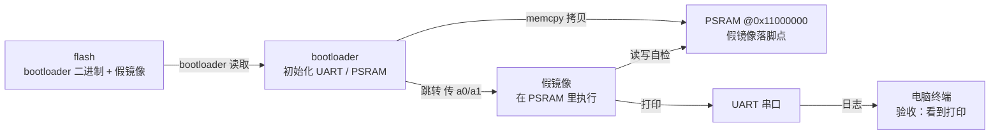

# S1 · 假镜像闭环

> 施工态 · 🚧 本阶段未通关，成文 / 钩子 / 自测通关时补

## 部件图（施工态）

图例：**粗框 = 要学透的部件（承重）**，细框 = 样板活（填充）。S1 从零起步，全图皆新。

## 决策清单（做到对应部件时再拍，先只挂问题）

- [ ] 镜像在 flash 里怎么放：分区表（picobin）还是固定偏移？（做到「flash 布局」时拍）
- [ ] PSRAM 片选脚：查 Waveshare 资料定死，还是用 pico-sdk `hardware_psram` 自动探测？（做到「PSRAM 初始化」时拍）
- [ ] 跳转参数：现在就把 a0/a1 按真内核协议占好位？（做到「跳转」时拍）
- [ ] 烧录工具：picotool 还是 DAPLink / OpenOCD？（做到「烧录」时拍）

## 要点段（要学透的部件验收后即时追加）

-（空）
