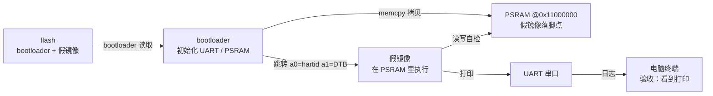

# S1 · 假镜像闭环

> rp2350-linux 移植 · 这份给人看（复盘文，读 = 复习）；续学接管看上级的 `学习地图.md`。

S1 回答了移植的第一问：怎么让一块陌生芯片「眼里出现」一块能跑程序的内存。答案是一条链——flash 里的镜像被 bootloader 拷进 PSRAM，再按约定把执行权交过去。链上每一环都用真板现象验收过，中间还撞上一颗坏 PSRAM 芯片。

**本阶段拍过的决策**：
- 镜像放 flash 固定偏移 64KB（以后再换 picobin 分区表）→ 先聚焦闭环
- PSRAM 片选脚先按资料定死（以后再自动探测）→ 单板求稳
- 跳转参数按真内核协议占位（a0 = hartid，a1 = DTB）→ S3 无缝接内核
- 时钟 150MHz 不超频 → 数据手册标称值
- 日志 USB + UART 双路 → Linux 接管前都用 USB 看
- 烧录 picotool 为主 → 新手友好
- 主力板 rp2350a_minimal（CS = GPIO0）；RP2350B-Plus-W 挂起

> 第一个钩子：为什么「能读到 PSRAM 的 ID」不等于「这块内存能用」？
> 

参考答案
读 ID 走 QMI 直通模式（寄存器操作），不经过 `0x11000000` 地址空间；真正第一次碰地址空间是写数据。坏芯片上「读 ID 正常、一写卡死」，两条独立驱动路径都如此，最后换板坐实。

## PSRAM 初始化：让 CPU 眼里出现一块内存

板上只有 520KB SRAM，装不下 Linux，所以 Linux 必须住进板子那颗 8MB PSRAM。PSRAM 是「长得像内存」的芯片：CPU 按地址读写，底层却是串行总线；RP2350 的 QMI 控制器把它映射到 `0x11000000`，从 CPU 视角看就是普通 RAM，能读写、能取指令（XIP）。

所以这一步的目标不是「使用 PSRAM」，而是「让 CPU 眼里出现这块地址空间」。没初始化前去访问它，要么全 0xFF 要么总线错误。活过来分三步：片选脚切到 QMI CS1（GPIO0）→ 直通模式发命令（复位、读 ID 确认 APS6404、切 quad）→ 按时钟设时序，XIP 激活。

片选脚、时序、时钟频率三样错一个，现象长得一模一样（读不到 ID / 全 FF）——这就是它成为第一个「要学透的部件」的原因。

> 段间钩子：跳转内核为什么不是简单的函数指针调用？
> 

参考答案
被跳过去的程序从第一行汇编起就要用寄存器里的值、要有一个能用的栈、要按自己的链接地址访问数据。这些「跳之前必须摆好」的东西就是跳转协议：a0 = hartid，a1 = DTB。bootloader 的职责就是摆好环境再把 PC 指过去。

## 跳转协议：函数指针背后的约定

跳转 = 约定，不是「函数指针 + 参数」这么简单。假镜像和以后的内核都不是从 `main()` 开始的——它们从第一行汇编就要用寄存器、栈、链接地址。

RISC-V Linux 的固定约定：`a0` = hartid，`a1` = 设备树物理地址。S1 假镜像按此占位（a1 传 NULL），S3 真内核直接接上。假镜像本身是一个链接在 `0x11000000` 的裸机程序：无 SDK、自己摆栈、直接写 PL011 寄存器——UART 由 bootloader 预先配好，外设状态跨跳转保留，这也是协议的一部分。

## 撞墙：读 ID 正常、一写卡死

psram-test 第一次联跑：ID 和大小都读到了，自检却静默停住。查数据手册发现 pico-sdk 默认异常入口是弱符号，兜底实现「静默睡死」——于是接管它，打印 RISC-V 异常三件套（mcause / mepc / mtval），得到 `mcause=2`（非法指令），但反汇编那个地址明明是合法指令，矛盾。

用三条工具链交叉验证（objdump、gdb、汇编器对答案）后，嫌疑从软件转向硬件。用户决定换驱动对照排除硬件——你当时一句「我先用 sfe_psram 测试一下有没有问题，排除硬件原因」，用的还是自己的旧工程（内部 sfe 驱动），同样卡在往 PSRAM 拷贝那一步。两条独立驱动路径都「读正常、写卡死」，判定硬件问题；换到自研的 RP2350A-Minimal（CS = GPIO0）后同一份代码直接 PASS，`mcause=2` 之谜随之消失——坏芯片的连锁反应。RP2350B-Plus-W 挂起研究，正如你说的「可能是时序问题，因为可以读到 PSRAM 的一些基本信息」。

#### ⚠️ 这一段踩过的小坑
- Hazard3 的 `mtval` 硬连线为 0（数据手册 3.8.4.1），别把 mtval=0 当成「没有目标地址」。
- 默认异常入口静默睡死：接管 `isr_riscv_machine_exception`（弱符号），且处理函数必须放 RAM（`.time_critical`），否则 `R_RISCV_JAL` 链接失败——向量表在 SRAM，JAL 只有 ±1MB。
- `picotool load` 的 `-o` 是**绝对地址**不是 flash 偏移：写偏移 64KB 要 `-o 0x10010000`；旧工程 `-fxup 0` 里的 `0` 其实是分区号。
- 反汇编别手算机器码——以 objdump + gdb + 汇编器三者一致为准（完整方法见 `RISC-V调试与反汇编速查.md`）。

## 假镜像闭环：S1 验收

假镜像 373 字节，入口 `_start` 在 `0x11000000`：摆栈 → `a0/a1` 原封不动就是 C 函数参数 → 打印 + 自检 → 死循环。bootloader 从 flash 64KB 拷 4KB 到 PSRAM，清 MIE，按协议跳转。

联跑现象：bootloader 打印 `copy done. first bytes: 37 f1 7f 11`（小端 = `0x117ff137` = `lui sp`，假镜像第一条指令）；假镜像在 UART 上打印 `[Fake Image] running from PSRAM!`、`a0 = 0x00000000`、`a1 = 0x00000000`，自检从 `0x11000000` 读回 `0x117ff137`——同一份数据，把「拷贝、指令取指、数据读」三个方向一次全验证了。

**自测**（盖住答案）
- Q1：为什么 PSRAM 的 ID 能读到、写却卡死？
  

参考答案
读 ID 走 QMI 直通模式（寄存器），写是第一次真正访问 `0x11000000` 地址空间；坏芯片/时序问题会让地址空间访问失败。

- Q2：异常三件套是哪三个 CSR？Hazard3 的 mtval 有什么特性？
  

参考答案
mcause（类型）/ mepc（出事指令地址）/ mtval（目标地址）；Hazard3 把 mtval 硬连线为 0。

- Q3：跳转假镜像/内核前，bootloader 要摆好哪三样？
  

参考答案
a0/a1（协议参数）、栈（sp）、入口地址（链接地址 = 运行地址）。

- Q4：换一块 PSRAM 在 GPIO19、镜像放 flash 1MB 的板子，要动哪几处？
  

参考答案
板卡头 CS 改 19、bootloader 的 FAKE_IMAGE_FLASH_XIP 改 0x10100000、烧录 `-o 0x10100000`；FAKE_IMAGE_SIZE 不用动（拷贝长度 ≠ 偏移），fake-image 不用动（链接地址没变）。

- Q5：`picotool load -o 0x10000` 为什么报 invalid memory range？
  

参考答案
`-o` 是绝对地址；flash XIP 从 0x10000000 开始，0x10000 不在映射里。

