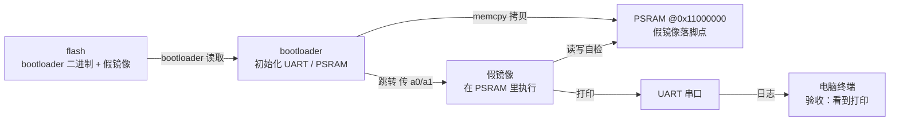

# S1 · 假镜像闭环

> 施工态 · 🚧 本阶段未通关，成文 / 钩子 / 自测通关时补

## 部件图（施工态）

图例：**粗框 = 要学透的部件（承重）**，细框 = 样板活（填充）。S1 从零起步，全图皆新。

## 决策清单（做到对应部件时再拍，先只挂问题）

- [x] 镜像在 flash 里怎么放 → **固定偏移**，以后镜像变复杂再换 picobin 分区表。理由：先聚焦闭环，简单优先。
- [x] PSRAM 片选脚 → **先按资料定死**，以后移植到其他板再改自动探测。理由：单板求稳。待落实：Waveshare RP2350 Plus 16MB 的资料（先试 GP47，实验读 ID 验证）。
- [x] 跳转参数 → **先按真内核协议占好 a0/a1**；「跳转」部件时把协议讲透。理由：为 S3 铺路，且用户要学透。
- [x] 烧录工具 → **picotool 为主，DAPLink / OpenOCD 也提供**。理由：picotool 新手友好。
- [x] 时钟频率 → **150MHz，先不超频**。理由：数据手册标称值，先求稳；以后用 240MHz 做对比实验。
- [x] PSRAM 骨架 → **pico-sdk `hardware_psram`**，讲原理时对照旧工程（`rpi-pico-lab/psram-rp2350-riscv-linux`）里的 `sfe_psram.c`。理由：官方库少踩坑，`sfe_psram.c` 能看到每一步 QMI 命令。
- [x] 日志通道 → **USB CDC + UART0 双路**（Linux 接管前都用 USB 看日志）。理由：不用转接线，新手友好；UART 留作内核阶段和备份。

## 讲解记录（复习用）

### PSRAM 初始化 · 第一环：它为什么存在

板上 CPU 只有 520KB 片上 SRAM，装不下 Linux——内核加根文件系统要好几个 MB。所以 Linux 必须住进板子上那颗 8MB 的 PSRAM。

PSRAM 是一种「长得像内存」的芯片：CPU 按地址读写，但底层其实是串行总线（QSPI 那类）。RP2350 的 QMI 控制器负责把它映射到 `0x11000000`——从 CPU 视角看，那只是一块普通 RAM，可以直接读写、甚至直接取指令执行（XIP）。

所以这一步的目标不是「使用 PSRAM」，而是「让 CPU 眼里出现 `0x11000000` 这块内存」。没初始化之前，去访问它要么读到全 0xFF，要么直接总线错误。

让它活过来分三步：

1. 把片选脚（CS1 = GPIO47）切到 QMI CS1 功能——信号线连对了，CPU 的命令才能送到 PSRAM 芯片；
2. 通过 QMI 的直通模式给芯片发命令：复位 → 读 ID 确认是 APS6404 → 切到 quad 模式；
3. 按当前时钟频率设好 QMI 时序参数，XIP 映射正式激活。

为什么这是要学透的件：片选脚、时序、时钟频率三样错一个，现象长得一模一样（读不到 ID / 全 FF），而且它是后面所有阶段的地基。

### 撞墙记录：PSRAM 自检停住（2026-08-20）

**现象**：`psram_is_available: 1`、`psram size: 8388608` 都正常，但输出停在 `write/read self-test on PSRAM...`，之后没有任何 PASS/FAIL。

**分析**：读 ID / 大小走的是 QMI 直通模式（寄存器操作），不经过 `0x11000000` 地址空间；自检函数是第一次真正访问 PSRAM 地址空间。所以这条分界线说明：芯片通信没问题，但 XIP 地址空间访问出了问题——大概率是 store/load 访问 fault。

**关键机制**：crt0（`crt0_riscv.S`）里机器异常入口 `isr_riscv_machine_exception` 是弱符号，默认兜底实现是「静默睡死，等调试器连接」——所以异常发生时屏幕上什么都没有。

**对策**：接管异常入口，打印 RISC-V 异常三件套：`mcause`（异常类型）、`mepc`（出事指令地址）、`mtval`（被访问的地址）。

### 岔路：排除硬件（2026-08-20）

**新现象**：`mcause = 0x2`（非法指令），`mepc = 0x100000f4`，但该地址反汇编（objdump 与 gdb 交叉验证）是 `mv a5,a1`——合法指令。矛盾待解。

**数据手册线索**：Hazard3 将 `mtval` 硬连线为 0（所以 mtval=0 正常）；手册明确建议模拟非法指令时「自己 dereference mepc 读指令字节」。

**用户决策**：先停手头分析，用 sfe 驱动做对照测试排除硬件——用户直接用自己的旧工程（内部用 `sfe_psram.c`）测试，同样卡住。当时顺手建的 `psram-test-sfe` 程序从未被烧录使用，已删除（需要时从旧工程取回 `sfe_psram.c` 即可）。

**对比判读**：旧工程（sfe 驱动）版也死在写 → 嫌疑在硬件/接线或两条驱动都缺的环节；旧工程 PASS → 问题锁定在 `hardware_psram` 路径。

**结论（2026-08-20）**：用户用旧工程（sfe 驱动）测试同样卡住，旧工程日志停在 `Kernel offset` 之后——即 `memcpy` 往 PSRAM 拷贝那一步。两条独立驱动路径都「读 ID 正常、写地址空间卡死」，判定为 **PSRAM 芯片硬件问题**，用户将更换 PSRAM 芯片。

**遗留待解**：`mcause=2（非法指令）@ mepc=0x100000f4`，而该处反汇编是合法 `c.mv`——换新芯片后第一个验证点：同样代码若直接 PASS，则此异常大概率是坏芯片引起的连锁现象；若复现，再深挖。

### 换板（2026-08-21）

RP2350B-Plus-W 换过 PSRAM 芯片仍无法写（两条驱动都「读 ID 正常、写卡死」），用户疑时序问题，挂起研究。主力板切换为自研 **RP2350A-Minimal**（A 版、16MB flash、8MB PSRAM、CS1 = GPIO0，已实测正常），后续开发以此为准。

## 要点段（承重部件 · PSRAM 初始化 — 验收 PASS）

**主张**：PSRAM 初始化 = 让 CPU 眼里出现 `0x11000000` 这块内存。QMI 把外部串行存储（QSPI）映射成普通地址空间，CPU 直接读写、甚至取指令（XIP）。

**机制因果链**：片选脚切到 QMI CS1（GPIO0）→ 直通模式发命令（复位 / 读 ID / 切 quad）→ 按时钟设时序 → XIP 激活。ID 能读到 ≠ 地址空间能写——自检才是第一次真正访问 `0x11000000`。

**坑**：坏 PSRAM 上「读 ID 正常、一写卡死」，两条独立驱动路径（hardware_psram / sfe）都如此，最终换板验证；异常入口默认静默睡死（弱符号，需接管）；Hazard3 的 mtval 恒 0；JAL ±1MB 链接错误 → 处理函数放 RAM（`__not_in_flash_func`）。

**验收现象**（RP2350A-Minimal）：`psram_is_available: 1`、`psram size: 8388608`、`PASS: PSRAM is alive at 0x11000000`。mcause=2 遗留问题随换板消失，关闭。

### 讲解记录：跳转协议 · 第一环（它为什么存在）

跳转不是「函数指针 + 参数」这么简单，背后是**约定**：被跳过去的程序（假镜像 / 以后的内核）不是从 `main()` 开始，它从第一行汇编起就要用寄存器里的值、要有能用的栈、要按自己的链接地址访问数据。跳之前必须摆好的这些东西 = 跳转协议。

RISC-V Linux 的固定约定：`a0` = hartid（哪个核在跑），`a1` = 设备树物理地址。S1 假镜像按此占位（a1 暂时传 NULL），S3 真内核无缝接上。

**S1 实现决策**：假镜像链接在 `0x11000000`（PSRAM 地址，无 SDK、无运行时，自己摆栈、直接写 PL011 寄存器——UART 由 bootloader 预先配好，镜像复用外设状态）；镜像放 flash 固定偏移 64KB，bootloader `memcpy` 4KB 到 PSRAM，清 MIE 后按协议跳转。

#### ⚠️ 这一段踩过的小坑

- `picotool load` 的 `-o` 是**绝对地址**（XIP 地址），不是 flash 偏移：写 flash 偏移 64KB 要 `-o 0x10010000`，写 `0x10000` 会被判「invalid memory range」。旧工程里 `-fxup 0 file.bin` 的 `0` 其实是分区号（`-p` 的参数，走 picobin 分区表），不是地址。

## 要点段（要学透的部件验收后即时追加）

-（空）
