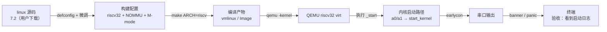

# S2 · QEMU 跑真内核

> 施工态 · 🚧 本阶段未通关，成文 / 钩子 / 自测通关时补

## 部件图（施工态）

图例：**粗框 = 要学透的部件（承重）**，细框 = 样板活（填充）。S2 从 S1 承接：S1 练的是「把镜像交到内存」，S2 换真内核，但在 QEMU 里练，先不碰真板。

## 决策清单（做到对应部件时再拍，先只挂问题）

- [x] 内核版本 → **linux 7.2**（用户拍板，kernel.org 下载源码）
- [x] 构建配置起点 → **`nommu_virt_defconfig` + `s2/rv32-nommu.config`**（32 位 fragment + SMP 关）。理由：7.2 已无 `rv32_defconfig`，fragment 是正路；SMP 先关与真板一致。
- [ ] DTB 来源：QEMU 外置 `-dtb` 还是内核内置？（到「启动」时拍）
- [ ] 是否带 initramfs：先不带，能出字就够？（到「启动」时拍）

## 要点段（要学透的部件验收后即时追加）

-（空）
