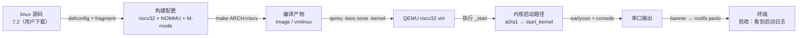

# S2 · QEMU 跑真内核

> rp2350-linux 移植 · 这份给人看（复盘文，读 = 复习）；续学接管看上级的 `学习地图.md`。

S2 把「镜像交到内存」升级成了真内核：主线 Linux 7.2 编成 riscv32 无 MMU、M 模式形态，在 QEMU virt 上看到完整启动链。三块核心收获：构建配置（哪些开关决定内核形态）、启动模式（M 模式 vs OpenSBI 的 S 模式）、链接地址（PIE 自我重定位）。

**本阶段拍过的决策**：
- 内核版本 → linux 7.2（用户拍板）
- 构建配置 → `nommu_virt_defconfig` + `s2/rv32-nommu.config`（32 位 fragment + SMP 关）——7.2 已无 `rv32_defconfig`，fragment 是正路
- DTB → 用 QEMU 自动生成的（S3 再自己写）

> 钩子：为什么「能编出来」不等于「能跑起来」？
> 

参考答案
内核还要回答运行环境的问题：在哪个特权模式启动（M 还是 S）、被加载到哪（链接地址 vs 加载地址）、硬件长什么样（DTB）。S2 撞的第一面墙就是模式不匹配。

## 构建配置：内核形态由开关决定

同一个内核源码要先回答几个问题：跑在什么架构（riscv）、字长多少（32/64）、有没有 MMU（决定要不要页表和虚拟内存）、跑在哪个特权模式、要哪些驱动。答案集中在 `.config`，defconfig 是「给某类机器预配好的答案模板」。

7.2 的关键开关：`CONFIG_ARCH_RV32I=y`（32 位，依赖 `NONPORTABLE`）、`CONFIG_MMU=n`、`CONFIG_RISCV_M_MODE=y`（M 模式直接跑，依赖 `!MMU`）、`CONFIG_SMP=n`。组合出来就是 rv32 + noMMU + M-mode，QEMU 里直接跑、不需要 OpenSBI。

#### ⚠️ 这一段踩过的小坑
- `scripts/kconfig/merge_config.sh` 必须**在构建目录里跑**（或带 `-O`），否则它把 `KCONFIG_CONFIG` 指到当前目录，会把合并结果写进源码树（`.config` 残留 → 报「源码树不干净」）。
- zsh 对不匹配的通配符会中断整条命令（`no matches found`），多步命令分步跑。

## QEMU 启动链：从 earlycon 到 rootfs panic

启动日志本身就是一条因果链：earlycon（uart8250 @ 0x10000000，来自 DTB 的 stdout-path）→ DTB 提供 memory / clint / plic / uart 节点 → 8250 console 接管（ttyS0）→ 定时器 clint、中断 plic → 走到 rootfs panic（`root=/dev/vda` 但没磁盘——预期断点，rootfs 是 S4 的事）。

**OpenSBI 墙**：QEMU virt 默认自带 OpenSBI，它在 M 模式初始化后把内核切到 S 模式启动（`Domain0 Next Mode: S-mode`）；M 模式内核一执行特权指令就卡死。修法 `-bios none`，这是 noMMU 内核的标准跑法。

## 链接地址与 PIE：为什么加载到哪都能跑

vmlinux 是 ET_DYN（PIE，位置无关）；noMMU 下 `PAGE_OFFSET = phys_ram_base`，内核启动时按**实际运行地址**自我重定位（虚拟地址 = 物理地址）。所以 QEMU 加载到 `0x80400000` 能跑；真板加载到 PSRAM `0x11000000` 同理——注意 rv32 要求 4MB 对齐，`0x11000000` 满足。

### 岔路：内核自我重定位到底做了什么（2026-08-21 用户岔路）

用户拿 ARM 裸机经验对比：链接地址 ≠ 加载地址时，要「拷 .data 到链接地址 → 清 .bss → 修所有绝对指针」。逐项对照内核实际代码：

1. **拷 .data 这步被省掉**：内核用 `CONFIG_CMODEL_MEDANY`（PC 相对寻址）+ PIE 编译，代码/数据引用全是 PC 相对（auipc/addi），内核就在被加载的地方运行，`.data` 不用搬。noMMU 的 `PAGE_OFFSET = phys_ram_base` 让链接地址在运行时变成实际物理地址。
2. **清 .bss 一模一样**：head.S `Clear BSS for flat non-ELF images` 循环（`__bss_start`/`__bss_stop`）。
3. **修绝对指针按表执行**：`CONFIG_RELOCATABLE=y` 时链接器把所有绝对引用收进 `.rela.dyn`；启动早期 `relocate_kernel()`（arch/riscv/mm/init.c）遍历表，每个 `R_RISCV_RELATIVE` 项加上加载偏移。原理 = 修位置相关的东西，但由编译器生成表、内核按表机械执行，比手写搬段更通用。

noMMU 特例：`KERNEL_LINK_ADDR = 0`（pgtable.h），偏移 = 运行时地址本身；不走 `relocate_enable_mmu`（那是 MMU 内核的页表重定位）。

## DTB：硬件说明书从哪来

QEMU 的 DTB 启动时动态生成，不在磁盘上（`-machine dumpdtb` 导出），经 a1 寄存器传给内核（OpenSBI 日志 `Domain0 Next Arg1: 0x87e00000` 是它在内存里的地址）。完整参考见 `QEMU-virt-DTB参考.md`。真板没有自动生成——S3 要照这个形状自己写一份，节点换成 RP2350 的。

**自测**（盖住答案）
- Q1：noMMU 内核的链接地址为什么不是问题？
  

参考答案
vmlinux 是 PIE；noMMU 下 PAGE_OFFSET = phys_ram_base，内核按实际运行地址自我重定位。加载需 4MB 对齐（rv32）。

- Q2：M 模式内核在 QEMU 里为什么卡在 OpenSBI 之后？怎么修？
  

参考答案
OpenSBI 把内核切到 S 模式启动，M 模式内核执行特权指令卡死。修法 `-bios none`，让内核直接在 M 模式启动。

- Q3：earlycon 和 console 有什么区别？
  

参考答案
earlycon 是启动最早的裸串口输出（不依赖驱动匹配/中断），console 是正式控制台（驱动接管后）。排查「没输出」先查 earlycon。

- Q4：DTB 怎么传给内核？
  

参考答案
RISC-V 协议 a1 寄存器传 DTB 物理地址；a0 传 hartid。真内核的 a1 不能是 NULL。

> 原始日志：`实验日志/2026-08-21_S2_QEMU首跑.md`（OpenSBI 卡住 + 成功两份完整日志）。
