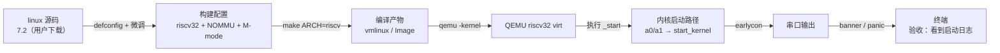

# S2 · QEMU 跑真内核

> 施工态 · 🚧 本阶段未通关，成文 / 钩子 / 自测通关时补

## 部件图（施工态）

图例：**粗框 = 要学透的部件（承重）**，细框 = 样板活（填充）。S2 从 S1 承接：S1 练的是「把镜像交到内存」，S2 换真内核，但在 QEMU 里练，先不碰真板。

## 决策清单（做到对应部件时再拍，先只挂问题）

- [x] 内核版本 → **linux 7.2**（用户拍板，kernel.org 下载源码）
- [x] 构建配置起点 → **`nommu_virt_defconfig` + `s2/rv32-nommu.config`**（32 位 fragment + SMP 关）。理由：7.2 已无 `rv32_defconfig`，fragment 是正路；SMP 先关与真板一致。
- [ ] DTB 来源：QEMU 外置 `-dtb` 还是内核内置？（到「启动」时拍）
- [ ] 是否带 initramfs：先不带，能出字就够？（到「启动」时拍）

## 要点段（要学透的部件验收后即时追加）

-（空）

## 撞墙记录：OpenSBI 之后没动静（2026-08-21）

**现象**：QEMU 停在 OpenSBI 平台信息（`Domain0 Next Mode: S-mode`）之后，内核一个字没出。

**分析**：QEMU virt 默认自带 OpenSBI 固件，OpenSBI 在 M 模式初始化后把内核切到 S 模式启动；而我们的内核是 `CONFIG_RISCV_M_MODE=y`，期待独占 M 模式，一上来执行特权指令就卡死。

**关键机制**：vmlinux 是 ET_DYN（PIE），noMMU 下 `PAGE_OFFSET = phys_ram_base`——内核按实际运行地址自我重定位，加载地址（0x80400000）不是问题；问题是启动模式。

**修法**：QEMU 加 `-bios none`，不用 OpenSBI，直接用 M 模式启动内核（noMMU 内核的标准跑法）。

### 讲解记录：启动模式与内核加载（2026-08-21）

- **为什么 OpenSBI 卡住**：QEMU virt 默认自带 OpenSBI 固件，它在 M 模式初始化后把内核切到 S 模式启动（`Domain0 Next Mode: S-mode`）；`CONFIG_RISCV_M_MODE=y` 的内核期待独占 M 模式，一执行特权指令就卡死。修法 `-bios none`（noMMU 内核的标准跑法）。
- **为什么加载地址不是问题**：vmlinux 是 ET_DYN（PIE，位置无关）；noMMU 下 `PAGE_OFFSET = phys_ram_base`，内核启动时按**实际运行地址**自我重定位（虚拟地址 = 物理地址）。所以 QEMU 加载到 `0x80400000` 能跑；真板上加载到 PSRAM `0x11000000` 同理——注意 rv32 要求 4MB 对齐，`0x11000000` 满足。
- **启动链解读（从日志看）**：earlycon（uart8250 @ 0x10000000，来自 DTB 的 stdout-path）→ DTB 提供 memory / clint / plic / uart 节点 → 8250 console 接管（`ttyS0`）→ 定时器 `clint@2000000`、中断 `plic@c000000` → 走到 rootfs panic（`root=/dev/vda` 但没磁盘——预期断点，S4 补 rootfs）。
- **联跑现象**：完整日志见 `实验日志/2026-08-21_S2_QEMU首跑.md`。
