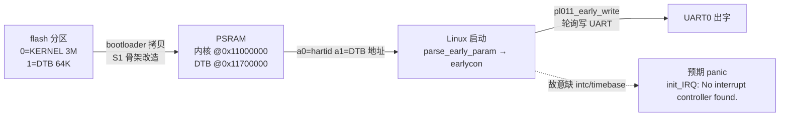

# S3 · 真板只接串口（00_earlycon 施工态）

> rp2350-linux 移植 · 施工态（未通关）；续学接管看上级文件夹 `学习地图.md`。

图例：bootloader 骨架 / PSRAM 初始化 / 跳转协议来自 S1（已有）；实线边是 S3-00 新增：真内核加载、DTB 传递、最小 DTB、earlycon。承重部件：真内核加载、最小 DTB、earlycon 出字 + 看到 panic。

🚧 本阶段未通关，成文/钩子/自测通关时补。

## 决策清单（施工态）

已拍：
- 分区：KERNEL id0 @64K size 3M；DTB id1 @3M+64K size 64K（2026-08-25）
- 加载地址：内核 @ 0x11000000；DTB @ PSRAM 顶部 0x11700000；跳转 a1 传 DTB 地址
- 工程规则：dts 分 `rp2350a.dtsi`（SoC 级）+ `rp2350a-minimal.dts`（板级），按工程所需增量添加，不一次性堆全
- bootargs：仅 `earlycon=pl011,mmio32,0x40070000,115200n8`（真 console 需要 clocks，留给后续工程）
- serial 节点先放但**不加 clocks/interrupts**：pl011 真驱动 probe 失败（日志可见），earlycon 不受影响
- **故意不加** `timebase-frequency` 和 `riscv,cpu-intc`（2026-08-25 用户拍板）：验收 = earlycon 出字 + 看到 panic；修复放后续工程

待拍：
- DTB 存放方式：已按「flash 分区 1」（推荐：改 DTB 只重烧分区，不动 bootloader）实现，待用户确认；备选「嵌入 bootloader 二进制」少一次烧录但改 DTB 要重烧 bootloader
