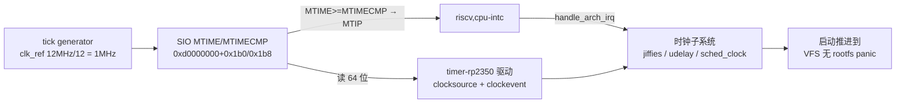

# S3-02 · 定时器链：init_IRQ panic 消失 + jiffies 动起来

> rp2350-linux 移植 · 这份给人看（复盘文，读=复习）；续学接管看上级文件夹 `学习地图.md`。
> 上一关 S3-01（earlycon 出字 + init_IRQ panic 验收）：`S3-01 · 从AMO墙到earlycon出字：完整踩坑历程.md`。原始日志：`实验日志/2026-08-27_S3-02定时器链验收.md`。



本阶段把"时间"正式接进内核：DTB 声明 RP2350 的平台定时器，新驱动把 MTIME 计数器变成 clocksource（时间读数）、把 MTIMECMP 比较器变成 clockevent（到点触发标准 MTIP 中断），中断经 `riscv,cpu-intc` 分发。验收 = init_IRQ 的 "No interrupt controller found." panic 消失、jiffies 真的走、启动一路推进到没有 rootfs 才停。

**本阶段拍过的决策**：
- 范围 → 只做定时器链；Xh3irq 外设中断留到 S3-03（定时器走 MTIP 直连，不需要它）
- 时间基准 → 1MHz tick，不绑死 sys_clock（bootloader 改 CPU 频率不影响内核时间）；DTB `timebase-frequency = <1000000>` 写死安全
- 阶梯重排 → 02=定时器链 / 03=Xh3irq / 04=真 console（PLAN 原表 02=console 作废）

> 第一个钩子：RP2350 有现成的 RISC-V 定时器，为什么不能直接用内核自带的 `timer-clint` 驱动？
> <details><summary>参考答案</summary>三个硬伤：① 寄存器偏移写死（CLINT 的 MTIME @ +0xbff8、MTIMECMP @ +0x4000，RP2350 在 SIO 的 0x1b0/0x1b8）；② 它强制要求 timer + soft 双中断，RP2350 的软中断在 SIO 另一个寄存器（RISCV_SOFTIRQ），单核用不上 IPI；③ 它用 writeq 写比较器（低半先写），RP2350 手册要求"先写全 1 → 高半 → 低半"，否则写入瞬间会假中断。DTB 只能描述设备在哪，改不了驱动里的硬编码。</details>

### 第一根枝：为什么现成的 clint 用不了

Linux 的 M 模式定时器驱动模板是 `timer-clint.c`（SiFive CLINT：MSIP + MTIMECMP + MTIME 三个功能区排在一个外设里）。RP2350 的"平台定时器"不在自己的外设里，而是塞在 SIO 里的三个寄存器（MTIME/MTIMECMP/MTIME_CTRL），软中断又在另一个寄存器。这不是"换个地址"能解决的——驱动里偏移、中断要求、写入协议三处都对不上。所以照 clint 的形状（clocksource + clockevent 两个角色）新写 `timer-rp2350.c`，寄存器换成 RP2350 的。

#### ⚠️ 这一段踩过的小坑
- `riscv_timebase` 的声明在 `asm/delay.h`，不在 `asm/timex.h`——新驱动编译报 undeclared。
- Kconfig 里 `bool "..." if COMPILE_TEST` 会让选项在非测试配置下没有可见提示，olddefconfig 会丢弃 defconfig 里的显式 `=y`（CLINT_TIMER 之所以能 y 是靠 `RISCV_M_MODE` 强制 select）。去掉 `if COMPILE_TEST` 后正常。

### 第二根枝：时间基准选 1MHz 而不是 150MHz

最初（S3-01 临时补丁）的做法是把 MTIME 切到 FULLSPEED，直接数 150MHz sys_clk，DTB 写 `timebase-frequency = <150000000>`。问题是 sys_clk 由 bootloader 决定、以后可能改，写死就错。你拍板"不写死"之后，调研发现更干净的答案：SDK 的 `runtime_init_clocks()` 在 main 之前就用 `clk_ref`（12MHz，固定）÷12 启动了 tick generator，喂给 RISC-V 定时器的就是恒定 1MHz——**跟 sys_clock 完全解耦**。所以 `timebase-frequency = <1000000>` 写死是安全的，驱动甚至不碰 MTIME_CTRL，只兜底检查 tick 有没有在跑。

### 第三根枝：init_IRQ panic 与 cpu-intc

上一关的 panic 点在 `arch/riscv/kernel/irq.c`：`if (!handle_arch_irq) panic(...)`。`handle_arch_irq` 是全局异常分发入口，由中断控制器驱动设置。DTB 给 `cpu@0` 加 `riscv,cpu-intc` 子节点后，`riscv_intc_init` 注册 irq domain 并 `set_handle_irq`——panic 消失。RISC-V 的本地中断（MTIP/MSIP/MEIP）都挂在 MIP CSR 上，M 模式下内核的 mask/unmask 写的就是 MIE（`CSR_IE` 在 M 模式别名到 `CSR_MIE`）。

### 第四根枝：percpu 中断（真板第一个卡点）

首烧后日志停在 `sched_clock`，`timer running` 打不出来。原因是 `riscv_intc_domain_map` 把所有本地中断都注册成 **percpu 中断**（`irq_set_percpu_devid` + `handle_percpu_devid_irq` 流程），驱动必须用 `request_percpu_irq` + `DEFINE_PER_CPU` clockevent + `enable_percpu_irq`。我一开始用普通 `request_irq`，语义不匹配卡在注册。对照 timer-clint.c 的写法改对后，`timer running at 1000000 Hz` 立刻出现，时间戳开始走。

### 第五根枝：dummy console 把 earlycon 禁了（输出断，不是死机）

下一烧日志停在 `printk: legacy bootconsole [pl11] disabled`。这不是死机：`CONFIG_VT=y` 让 VT 子系统注册了 dummy console（tty0），而 printk 的规则是"注册第一个非 boot console 时禁用 bootconsole"——earlycon 被禁，串口没有新 console 接管，输出就断了。临时方案是在 defconfig 里禁 `CONFIG_VT`（你提醒 VT 以后可能被 framebuffer console 依赖，正解是只禁 `CONFIG_DUMMY_CONSOLE` 或等 S3-04 真 console 走正常接管）。

### 第六根枝：LR/SC 条件原子操作墙（本阶段最大的坑）

禁掉 VT 后日志推进到 `Mountpoint-cache` 就**必现卡死**（复位多次复现）。GDB 抓现场，pc 落在：

```text
lr.w a3,(a1); beq a3,a5,...; add a2,a3,a4; sc.w.rl a2,a2,(a1); bnez a2,loop
```

按地址反查 System.map，这是 `deactivate_super` 里的 `atomic_dec_and_test` → 底层 `arch_atomic_fetch_add_unless(v, -1, 1)`。根因是 S3-01 那堵墙的残留：**LR/SC 在 PSRAM 上不 fault，`sc.w` 静默返回失败**（手册 2.1.6 排他监视器只认 SRAM），于是循环永不退出。S3-01 当时只把 cmpxchg 强制改走 amocas.w，而 arch/riscv/include/asm/atomic.h 里还有 4 个"有条件原子操作"（fetch_add_unless / inc_unless_negative / dec_unless_positive / dec_if_positive）用 LR/SC 实现，这次撞上了。

修复：这 4 个操作在 `CONFIG_RISCV_AMO_EMULATION` 下改写为 `arch_cmpxchg`（amocas.w）循环——AMO 编码会 fault，模拟器兜底。反汇编确认 `deactivate_super` 生成 `amocas.w.aqrl`。之后把内核里所有剩余 LR/SC 排查了一遍：调度器的 `lr.w` 是只读轮询（安全）、futex 一整套（NOMMU 启动不执行）、`ret_from_exception` 的 `sc.w` 是清 reservation（注释明说 store 不完成也无妨）。

### 验收：完整启动到 VFS panic

修复后日志一路走完：`calibrate_delay ... lpj=4000`（S3-01 的 udelay 卡死点正式跨过）、`clocksource: Switched to clocksource rp2350_mtime`（时间基准切到 MTIME）、devtmpfs/serial 驱动注册/clk 管理全过，最后停在预期新断点：

```text
Kernel panic - not syncing: VFS: Unable to mount root fs on unknown-block(0,0)
```

这是"没有 rootfs"的正常终点，S4 之后接 initramfs + busybox 就能进 shell。两个小告警（`unable to open an initial console`、pl011 注册但没接管）都是真 console 未做的正常表现，记在 S3-04。

> 段间钩子：为什么"时间基准写死 1000000"不算违反你"不要写死"的要求？
> <details><summary>参考答案</summary>因为写死的不是会变的量。1MHz 来自固定的 clk_ref（12MHz）÷12，与 bootloader 可调的 sys_clk 无关；`timebase-frequency` 描述的是 MTIME 计数器的真实频率，它恒定，所以写死是诚实的。真正不能写死的是 sys_clk 相关的 150MHz。</details>

#### ⚠️ 这一段踩过的小坑
- savedefconfig 导出的完整 defconfig 是唯一真源；手工往 defconfig 加选项后要重新 savedefconfig 规范化。
- GDB 里看到的地址是 PSRAM 加载地址（0x11000000 + 偏移），查符号要减基址再对 System.map/vmlinux。

**自测**（盖住答案，3-7 题按内容厚度定）
- Q1：RP2350 为什么不能直接用 timer-clint 驱动？三个理由各是什么？
  <details><summary>参考答案</summary>偏移写死（0x4000/0xbff8 vs 0x1b0/0x1b8）；强制 timer+soft 双中断（RP2350 软中断不在定时器外设里）；writeq 写 MTIMECMP 低→高会假中断（手册要求全 1 → 高 → 低）。</details>
- Q2：为什么 `timebase-frequency = <1000000>` 可以放心写死？
  <details><summary>参考答案</summary>tick generator 用固定 clk_ref（12MHz）÷12 喂给 MTIME，恒 1MHz，与 sys_clk 解耦；驱动兜底启动 tick。</details>
- Q3：为什么用普通 request_irq 会卡在中断注册？
  <details><summary>参考答案</summary>riscv,cpu-intc 的中断全是 percpu 类型（irq_set_percpu_devid + handle_percpu_devid_irq），必须用 request_percpu_irq + per-cpu clockevent + enable_percpu_irq。</details>
- Q4：日志停在 "bootconsole disabled" 是死机吗？
  <details><summary>参考答案</summary>不是。VT 注册 dummy console（tty0）后 printk 禁用了 bootconsole（earlycon），串口没有新 console 接管所以静默，系统还在跑。</details>
- Q5：LR/SC 在 PSRAM 上的行为是什么？为什么会导致死循环？
  <details><summary>参考答案</summary>排他监视器只认 SRAM：PSRAM 上 lr.w 正常读、sc.w 静默返回失败（不 fault）。原子循环把失败当"有竞争"重试，永不退出。所以 PSRAM 上所有原子路径都必须走 AMO（fault → 模拟器）。</details>
- Q6（迁移四问）：新板子定时器布局不同，怎么接进 Linux？
  <details><summary>参考答案</summary>① DTB timer 节点 + drivers/clocksource 新驱动；② 照 clint/timer-rp2350 形状：clocksource（读计数器）+ clockevent（写比较器+定时器中断）；③ 坑：偏移写死、比较器写序列假中断、percpu 中断 API、LR/SC 非 SRAM 静默失败；④ 验：timer running + 时间戳推进 + lpj + init_IRQ 过 + 到新断点。</details>
