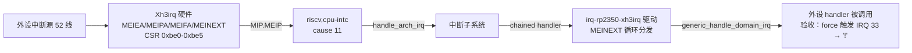

# S3-03 · Xh3irq 外设中断：UART0 中断链验收

> rp2350-linux 移植 · 这份给人看（复盘文，读=复习）；续学接管看上级文件夹 `学习地图.md`。
> 上一关 S3-02（定时器链）：`S3-02 · 定时器与中断链.md`。原始日志：`实验日志/2026-08-28_S3-03外设中断验收.md`。

本阶段把**外设中断**接进内核：Xh3irq 是 Hazard3 自定义中断控制器（不是标准 PLIC），用一组 CSR 数组管理 52 条系统中断线，把最高优先级的中断从 MEINEXT 读出，聚合到标准 MIP.MEIP。新驱动负责三件事：irq domain（52 线）、chained handler（MEINEXT 循环分发）、MEIEA mask/unmask。验收 = 软件触发（MEIFA force）IRQ 33，中断一路走到测试 handler 输出 `!`。

**本阶段拍过的决策**：
- 验收中断源 → UART0（后来发现 RX 中断要 tty open，改用 MEIFA force 验证控制器本身；真实 UART RX 留到 S6）
- 优先级 → 全同优先级（不配 MEIPRA，无嵌套；16 级抢占后补）
- PL011 接入 → DTB 用 `arm,sbsa-uart`（RISC-V 无 AMBA 总线，`arm,pl011` 的 amba 驱动 probe 不到；SBSA 是 platform 驱动，内核零改动）

> 第一个钩子：Xh3irq 不是 PLIC，Linux 没有现成驱动。它的"下一个要处理的中断"怎么读？
> 

参考答案
MEINEXT CSR（0xbe4）：读返回最高优先级可处理中断（IRQ 号左移 2 位，bit31=无中断），同一指令写 UPDATE 位让硬件更新 MEICONTEXT（抢占上下文）。pico-sdk 的 crt0 汇编里就是 `csrrsi MEINEXT, UPDATE` + 循环分发。

### 第一根枝：Xh3irq 的 CSR 数组

普通中断控制器用 MMIO 寄存器管中断（PLIC/APLIC 的 enable/pending/priority 寄存器）。Xh3irq 用 **CSR 数组**：52 条线，每条 1 个 enable/pending/force/priority 位，按 16 位一组窗口。操作写法：低 5 位选窗口（irq/16），高 16 位是数据（bit = irq%16）。`csr_set/csr_clear` 就能置位/清位。

### 第二根枝：RISC-V 上 PL011 不 probe（AMBA 总线缺失）

`arm,pl011` 的驱动是 amba_driver，靠 AMBA 总线匹配设备。RISC-V 内核没有 AMBA 总线（`CONFIG_ARM_AMBA` 依赖 ARM），`amba_driver_register` 在无 AMBA 时是返回 -EINVAL 的 stub——**驱动注册了但永远不会 probe**，`ttyAMA0` 出不来。你拍板换 `arm,sbsa-uart`：SBSA 驱动是无条件注册的 platform_driver，且 `vendor_sbsa.access_32b=true` 正好是 32 位访问，`current-speed=<115200>` 定波特率，连时钟都不用配。结果 `ttyAMA0 ... is a SBSA` + console 接管（S3-04 的核心现象提前打通）。

### 第三根枝：IRQ 14 风暴与 MEIEA 幽灵位

驱动注册后启动卡死在 `timer running`。诊断确认 **MEINEXT 无限返回 IRQ 14**（USBCTRL_IRQ）。两个根因叠一起：

1. **IRQ 14 的源复位后一直 assert**（USB 控制器活跃时），而 MEINEXT 同优先级按编号小优先；
2. **MEIEA 复位后不是全 0**——诊断读到 bit3/bit14 被置位（文档/头文件写的是 0，硅片实际非 0）。

所以 14 一直 pending+enabled，chained handler 分发给它，没有驱动清源 → 死循环。修复两道：**驱动 init 时清空 MEIEA 全部窗口**（中断控制器启动本来就该全 disable），**chained handler 对无 handler 的 IRQ 直接 mask**（电平风暴兜底，任何无主电平中断都该这么处理）。

### 第四根枝：UART RX 中断要 tty open

往串口发字符不触发中断。根因：PL011 的 RX 中断在 `uart_startup()`（tty 端口被 open）时才注册并使能；console 注册只配置端口、不 open tty。**没有用户空间 open `/dev/ttyAMA0`，RX 中断从未使能**——这不是 bug，是内核设计。对策：改用 **MEIFA force**（软件强制 pending）验证 Xh3irq 链本身，不依赖外设和时机。

### 第五根枝：分发调用被误删（最大乌龙）

force 触发后 diag 显示 `irq=33 virq=33`、desc 状态全正常，但 handler 计数器永远 0。查到最后是**低级错误**：加防风暴补丁重写 chained handler 循环时，**`generic_handle_domain_irq()`（真正调用 handler 的步骤）被误删**——函数里只剩 irq_find_mapping（查）和位操作（清），"只查不办"。你当时就看出函数里没有调用 handler 的部分，但以为不需要，没点破。补回后 `!` 输出、`rx_test_count=2`，验收达成。

> 段间钩子：为什么"无 handler 就 mask"是电平中断控制器必须的兜底？
> 

参考答案
电平型源在 handler 清掉源头之前一直 assert，MEIPA 一直 pending；如果没人处理，MEINEXT 每次循环都返回同一个 IRQ，chained handler 死循环。mask 掉（MEIEA 清位）后它不再进 MEINEXT，风暴停止。

#### ⚠️ 这一段踩过的小坑
- `hbreak`（硬件断点）调试依赖目标代码可断点；中断是否被调最可靠的是**日志/计数器**，不是断点。
- 中断上下文里 `pr_info`（printk → console 输出）有风险，测试 handler 用**直接写 UART 寄存器**（绝对地址）最稳。
- `csr_set/csr_clear` 宏要求操作数是编译期常量（字符串化），参数名不能叫 `csr`。

**自测**（盖住答案）
- Q1：Xh3irq 的 CSR 数组怎么操作？MEINEXT 怎么读下一个中断？
  

参考答案
低 5 位选窗口（irq/16）、高 16 位数据（bit=irq%16）；MEINEXT 读返回 IRQ 号<<2（bit31=无），同一指令写 UPDATE 更新 MEICONTEXT。

- Q2：为什么 `arm,pl011` 在 RISC-V 上不 probe？换什么？
  

参考答案
pl011 是 amba_driver，RISC-V 没有 AMBA 总线（CONFIG_ARM_AMBA 依赖 ARM）；换 `arm,sbsa-uart`（platform 驱动，access_32b=true）。

- Q3：IRQ 14 风暴的根因是什么？两道修复各解决什么？
  

参考答案
MEIEA 复位非零（幽灵位）+ USBCTRL 源一直 assert；init 清空 MEIEA（无主位不使能）+ 无 handler 就 mask（电平风暴兜底）。

- Q4：为什么往串口发字符不触发 RX 中断？
  

参考答案
PL011 RX 中断在 tty open（uart_startup）时才使能，console 不 open tty；无 shell 阶段用 MEIFA force 验证控制器本身。

- Q5（迁移四问）：新板子的中断控制器不是标准 PLIC，怎么接？
  

参考答案
① 写 irqchip 驱动（irq domain + chained handler + mask/unmask）+ DTB 节点（interrupts-extended 连 cpu-intc 的 MEIP）；② 照 irq-sifive-plic / irq-rp2350-xh3irq 的形状：chained handler 循环取下一个中断 → generic_handle_domain_irq；③ 坑：无 handler 电平中断会风暴（要 mask）、启动时清 enable 数组、分发调用别丢；④ 验：force 触发 + handler 输出可见标记（日志/计数器/直接写 UART）。

