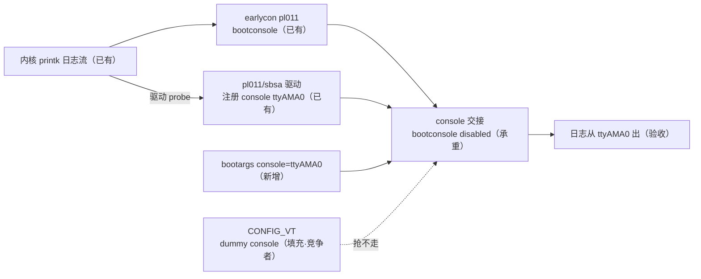

# S3-04 · 真 console 收尾：ttyAMA0 确定接管日志

> rp2350-linux 移植 · 这份给人看（复盘文，读=复习）；续学接管看上级文件夹 `学习地图.md`。

这一关不搭新链——S3-03 已经把 ttyAMA0 注册成 console 并实际接过一次日志。要解决的是交接的**确定性**：把 `console=ttyAMA0` 写进 bootargs 锁死首选，恢复 CONFIG_VT 验证 dummy 抢不走，给 DEBUG_INFO 行号定位收尾，并定案 sbsa-uart 长期使用。

**本阶段拍过的决策**：
- 决策① VT 取舍 → **VT 保持打开**，日志由 `console=` 锁给 ttyAMA0（对照实验证明 dummy 抢不走，无需放弃 VT）
- 决策② sbsa-uart 定案 → **长期用**（console+shell 够用、零内核改动；完整 pl011 platform 入口留作后续可选课题）
- 决策③ DEBUG_INFO（DWARF5）行号定位成为标准排障配置（沿用 72b30b2）

> 第一个钩子：S3-03 时日志明明已经自动切到 ttyAMA0 了，为什么还要显式写 `console=`？
> 

参考答案
自动切换只在"没有竞争者"时成立。S3-03 的 defconfig 关掉了 CONFIG_VT，ttyAMA0 是唯一真 console，谁先注册谁默认，自然接管。一旦 VT 回来，tty0（dummy console）注册得早，没有 console= 时它会先当上默认，把日志接到不存在的显示设备上——串口从此安静，像卡死（S3-02 撞过）。console= 把 ttyAMA0 标为首选，注册再晚也归它。

### 第一根枝：console 交接的两段与首选

日志打印分两段。早期是 earlycon（bootconsole），直写 PL011 寄存器，从第一条日志就开始打。之后真正的 console 驱动注册进来，printk 交接：bootconsole 关闭、日志由真 console 接管。交接给谁由 bootargs 的 `console=` 决定——有首选时，printk 跳过"谁先注册谁默认"的兜底（register_console 里 `preferred_console < 0` 才走默认），不匹配首选的 console 注册了也不启用。

### 第二根枝：dummy console 为什么抢不走

CONFIG_VT 恢复后日志出现 `Console: colour dummy device 80x25`——这是 VT 给 /dev/tty0 配显示设备的初始化消息，正常。但没有 `legacy console [tty0] enabled`：tty0 没被启用成 printk console，因为它不匹配首选。对照实验里唯一新出现的行 + 全程缺席的那一行，一正一负就是验收证据。这里最容易被误读：**dummy device 消息 ≠ tty0 成为内核 console**。

### 第三根枝：双打印不是 bug

`console [ttyAMA0] enabled` 和 `legacy bootconsole [pl11] disabled` 各出现两遍、时间戳相同——同一记录被两个 console 各写到 UART 一次。register_console 先把新 console 加进列表再打 enabled，那一刻 bootconsole 还在列表里；unregister 函数第一行就打 disabled，此时 bootconsole 自己还没摘除。内核注释写明这是故意：让 enabled 出现在所有 console 上，提醒日志缓冲区里可能有只发给过 bootconsole 的内容。

### 第四根枝：sbsa-uart 定案

`arm,sbsa-uart` 由 amba-pl011.c 里的独立 platform 驱动（sbsa_uart_probe）处理，不需要 AMBA 总线，所以 RISC-V 上能 probe。它仍是同一套 PL011 硬件框架（ttyAMA0），只是能力裁剪：固定 8n1、无流控、波特率由 DT `current-speed` 定死、无 DMA、32 位访问正好匹配 RP2350。tty 打开后 RX 中断照常使能（sbsa_uart_startup → pl011_enable_interrupts），S3-05 shell 打字没问题——长期用。

### 第五根枝：DEBUG_INFO 行号

CONFIG_DEBUG_INFO_DWARF5 只影响 vmlinux，Image 大小不变。log-analyze.sh 的 Call Trace 现在显示 函数名 + 源文件:行号，pc-locate.sh 同样带行号。排障从"对着裸地址猜"变成"直接看源码行"。

#### ⚠️ 这一段踩过的小坑
- log-analyze.sh 清理 addr2line 的 `..` 路径段时，正则把 `..` 后面的分隔符一起吞掉（`linux-7.2arch` 少了斜杠）——改 `s#/[^/]+/\.\.##` 保留后续 `/`。
- 双打印（enabled/disabled 各两遍）是正常广播现象，别当 bug 查。
- 烧录流程：改 DTB 只烧 dtb 分区，内核没动不用重烧；每关工程目录独立（s3/04_console/），03 归档保持原样。

**自测**（盖住答案）
- Q1：为什么 S3-03 不写 console= 日志也正常，S3-04 却要写？
  

参考答案
S3-03 关了 CONFIG_VT，ttyAMA0 是唯一真 console，谁先注册谁默认自然接管；VT 恢复后 tty0 注册早，没 console= 会被它抢走，所以要显式锁首选。

- Q2：`Console: colour dummy device 80x25` 出现说明什么？它等于 tty0 接管日志吗？
  

参考答案
说明 VT 子系统初始化了（给 /dev/tty0 配显示设备）；不等于——tty0 是否成为 printk console 要看有没有 `legacy console [tty0] enabled`。

- Q3：为什么 enabled/disabled 各打两遍？
  

参考答案
同一条记录被两个 console 各写一次：打 enabled 时 bootconsole 还在列表；打 disabled 时 bootconsole 自己还没摘除。内核故意这样，提醒可能有 bootconsole 独享的日志。

- Q4（迁移四问）：换一块用 16550 串口的板子，要让 ttyS0 当 console，动什么？照什么形状？坑在哪？怎么验？
  

参考答案
DTB 加 16550 节点（compatible/reg/interrupts/clock）+ bootargs console=ttyS0；照现成 8250 驱动 + console= 首选的形状；坑：不写 console= 会被别的 console（VT/dummy）抢、波特率/分频要配时钟节点；验：Kernel command line 看到 console=ttyS0、`console [ttyS0] enabled` 后日志继续出。

