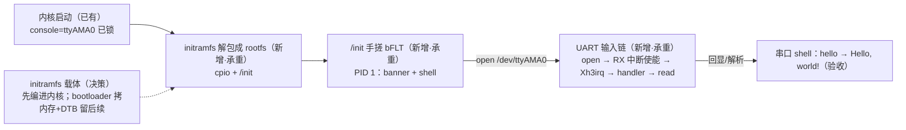

# S3-05 · 进 shell：initramfs + 自写 /init

> rp2350-linux 移植 · 这份给人看（复盘文，读=复习）；续学接管看上级文件夹 `学习地图.md`。



这一关让板子从"VFS panic"变成"能敲命令的 shell"。用 initramfs（编进内核的 cpio）当根文件系统，里面只放一个自写 `/init`；NOMMU 用户态只能跑 bFLT，工具链没有 elf2flt 就手搓；PID 1 打印 banner、挂 devtmpfs、open `/dev/ttyAMA0`、raw 模式读键盘、`hello` 命令回 `Hello, world!`。**项目终点"串口进 shell"在这一关达成。**

**本阶段拍过的决策**：
- 决策① initramfs 进内核方式 → **先编译进 Image**（`CONFIG_INITRAMFS_SOURCE`）；bootloader 拷内存 + DTB `linux,initrd-start/end` 留后续
- 决策② /init shell 程度 → **`# ` 提示符 + 字符回显 + 回车解析 + 只支持 hello 命令**
- 沿用：`console=` 锁 ttyAMA0（S3-04）、DEBUG_INFO 行号（72b30b2）

> 第一个钩子：内核怎么知道"rootfs 里有 /init 就不挂块设备根"？
> <details><summary>参考答案</summary>`kernel_init_freeable()` 里 `init_eaccess("/init")` 通过就跳过 `prepare_namespace()`——VFS panic 正是从那个没被跳过的分支（挂块设备根）来的。全链路见 `notes/内核initramfs与rootfs启动链路详解.md`。</details>

### 第一根枝：initramfs 当根（部件 R）

`CONFIG_INITRAMFS_SOURCE` 指向 gen_init_cpio 清单 → 构建时打成 cpio（默认 gzip）编进 Image。启动时 rootfs（ramfs）挂为初始根，`populate_rootfs()` 异步解包；`console_on_rootfs()` 打开 `/dev/console` 给 init 当 stdio（**清单必须自带这个设备节点**，否则内核只在无 initramfs 时自动建）；`init_eaccess("/init")` 通过 → 跳过 prepare_namespace → 直接以 rootfs 为根跑 `/init`。bootargs 不能加 `root=`。真板现象：VFS panic 消失、`S3-05 initramfs OK` 打出。

### 第二根枝：bFLT——NOMMU 的二进制格式

`CONFIG_BINFMT_ELF` 依赖 MMU，NOMMU 用户态只能用 uClinux FLAT。没有 elf2flt → 手搓 `scripts/pack-bflt.sh`：**64 字节大端头**（magic + 10 字段 + filler[5]）告诉加载器 entry/data/bss 偏移；text 从文件偏移 64 开始；data 必须 32 字节对齐（加载器 `FLAT_DATA_ALIGN=0x20`）；**不能有运行时重定位**（`-fPIC -mno-relax -msmall-data-limit=0 -no-pie` + 全内部符号，auipc/addi 链接期算死）。格式与加载器细节见 `notes/bFLT格式与手搓打包详解.md`、执行链路见 `notes/内核FLAT程序执行链路详解.md`。

#### ⚠️ 这一段踩过的小坑
- **bFLT 头是 64 字节不是 32**：entry 按 32 算会指向头的 filler 零区 → SIGILL（`Code:` 全零）。`pack-bflt.sh` 已用 `HDR_SIZE=64`。
- **ELF 必须 `-no-pie`**：默认 PIE 带 `.interp/.dynsym/.got` 动态段，objcopy 输出被污染 → 入口落零。已加编译参数 + 链接脚本 `/DISCARD/` + 打包脚本"类型必须 EXEC"校验。
- **手搓格式要"文件实际布局 ↔ 头字段"对得上**：当时只核对了头字段，没核对 entry 指向的字节。

### 第三根枝：exec 链路与潜伏的原子 bug

`Run /init as init process` 出现后第一次执行就撞 `Failed to execute /init (error -26)`（ETXTBSY）。`deny_write_access`（exec 时禁止执行"正在被写"的文件）用的 `atomic_dec_unless_positive` 被 S3-02 的 amocas 改造（87546b2fd）**返回值写反**：减成功了却返回 false → 误判失败。`i_writecount=-1` 的调试打印是"减成功但返回反了"的铁证。内核自身从不 exec 用户程序，这 bug 潜伏两个关卡，到第一次 exec 才引爆。

### 第四根枝：真实 UART 输入链

console 只管输出；输入链要 `/init` 显式 open tty（uart_startup 才使能 RX 中断）。另外 initramfs 当根时 prepare_namespace 被跳过，**devtmpfs 不会自动挂**，/dev/ttyAMA0 不存在——/init 先 `mount devtmpfs /dev` 再 open。termios 必须 raw（关 ISIG/ICANON/ECHO），否则 ldisc 双回显、Ctrl-C 还能杀 PID 1。

### 第五根枝：MEICONTEXT——只触发一次的中断（本关最大的坑）

shell 回显 `h` 后后续输入全无，但内核活着（定时器照走）。根因（手册 3.8.6.1.5）：MEIP 入口硬件推 PREEMPT 优先级栈并置 MRETEIRQ=1，mret 只在 MRETEIRQ=1 时弹栈；**任何非 MEIP 陷阱（1ms 定时器 MTIP）清 MRETEIRQ**。chained handler 不保存/恢复 MEICONTEXT → 首次外中断回程时定时器把 MRETEIRQ 清了 → 栈不弹 → PREEMPT 卡 0x10（高于全部外部中断优先级）→ 外部中断永久屏蔽。修复：进入时 `csr_read_set(MEICONTEXT, CLEARTS)` 保存、退出前 `csr_write` 恢复（pico-sdk 协议）。S3-03 用 MEIFA force 单发触发验收，从没测过"同一中断第二次触发"，正好掩盖了这个缺漏——**单发触发只能证明链通，证明不了连续输入**。

## 验收（2026-08-28 ✅）

```
[    1.575523] Run /init as init process
S3-05 initramfs OK
# hello
Hello, world!
# adc
unknown command
#
```

**自测**（盖住答案）
- Q1：initramfs 为什么能跳过 VFS panic？
  <details><summary>参考答案</summary>rootfs 里有可执行的 /init（init_eaccess 通过）→ kernel_init_freeable 跳过 prepare_namespace（块设备根流程）。</details>
- Q2：NOMMU 为什么不能跑 ELF？bFLT 头多大？entry 为什么是 64？
  <details><summary>参考答案</summary>CONFIG_BINFMT_ELF depends on MMU；bFLT 头 64 字节（magic+10 字段+filler[5]）；text 从文件偏移 64 开始，entry 指向第一条指令。</details>
- Q3：第一个字符能收、后面全没，最可能是什么？
  <details><summary>参考答案</summary>中断控制器上下文没恢复：非 MEIP 陷阱清 MRETEIRQ → mret 不弹优先级栈 → PREEMPT 卡死 → 外部中断全屏蔽。修法：MEICONTEXT 进出保存/恢复。</details>
- Q4：为什么 /init 要先挂 devtmpfs？
  <details><summary>参考答案</summary>initramfs 当根时 prepare_namespace 被跳过，devtmpfs 不自动挂，/dev/ttyAMA0 不存在。</details>
- Q5：验收为什么"单发触发"不够？
  <details><summary>参考答案</summary>单发只能证明中断链通，证明不了连续输入（MEICONTEXT 这类"第二次起失效"的 bug 只有连续输入才暴露）。</details>
- Q6（迁移四问）：新板子换 16550 UART，键盘输入进 shell 动什么、照什么形状、踩什么坑、怎么验？
  <details><summary>参考答案</summary>DTB 加 ns16550a 节点 + bootargs console=ttyS0 + 查中断控制器（能套现成驱动就套，否则按手册写 irqchip）；/init 照本关形状（devtmpfs + open tty + raw）；坑：RX 中断要 open 才使能、irqchip 必须保存/恢复现场（MEICONTEXT 教训）、bFLT 头 64/entry=64/-no-pie；验：连续敲 hello 回显，单发 force 只能验链通。</details>
