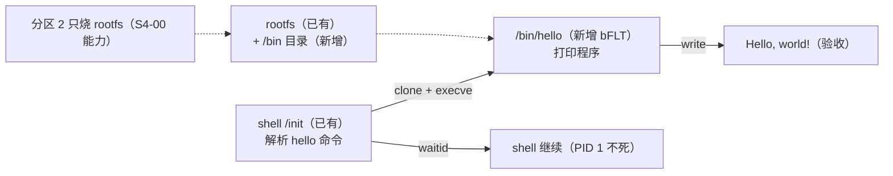

# S4-01 · shell 调用外部程序：/bin/hello

> rp2350-linux 移植 · 这份给人看（复盘文，读=复习）；续学接管看上级文件夹 `学习地图.md`。



shell 解析 `hello` 时不再自己打印，而是**进程创建**：vfork + execve 拉起 rootfs 里的 `/bin/hello`（第二个手搓 bFLT），父进程 waitid 回收后再回提示符。NOMMU 首次做多进程，只烧分区 2 就完成整关。

**本阶段拍过的决策**：
- 决策① 进程创建语义 → **vfork**（CLONE_VM|CLONE_VFORK：NOMMU 无 COW，fork 全量拷贝；vfork 借用父地址空间直到 exec，uClinux 传统）。fork/vfork 详解见 `notes/进程创建fork与vfork详解.md`。

> 第一个钩子：shell 是 PID 1，为什么不能直接 exec `/bin/hello`？
> <details><summary>参考答案</summary>exec 会替换当前进程镜像：如果 PID 1 自己 exec hello，hello 退出时退出的就是 init → `Attempted to kill init` panic。必须先造子进程（clone），让子进程 exec，父进程 waitid 等它结束。</details>

### 第一根枝：进程创建链

```c
pid = clone(CLONE_VM | CLONE_VFORK | SIGCHLD, 0, 0, 0, 0);   /* vfork 语义 */
if (pid == 0) {
    execve("/bin/hello", argv, envp);   /* 子进程换镜像；成功不会回来 */
    _exit(127);                          /* 失败必须 _exit，不能 return */
}
if (pid > 0)
    waitid(P_PID, pid, NULL, WEXITED, NULL);  /* 父进程回收 */
```

argv/envp 必须**在栈上现拼**（`argv[0] = path; argv[1] = 0;`）：写成静态指针数组 `static const char *argv[]` 会产生数据重定位（R_RISCV_32），pack-bflt.sh 直接拒。

### 第二根枝：两个架构坑（查表比猜号可靠）

1. **riscv32 没有 wait4**：asm-generic 的 `__NR_wait4 260` 只在"32 位 time32 架构或 64 位"下进系统调用表，riscv32 是 32 位且不启用 time32 老接口 → wait4 调用返回 **-ENOSYS**。这类架构等子进程用 **waitid(95)**（time64 安全版）。
2. **waitid 的 options 必须显式含 WEXITED/WSTOPPED/WCONTINUED 之一**：传 0 直接 **-EINVAL**（kernel/exit.c `kernel_waitid_prepare` 校验），和 wait4 的"options=0=等退出"语义不同。父进程没等到子进程，提示符就会抢在子进程输出前面。

### 第三根枝：/bin/hello 与 rootfs

`hello-src/hello.c`：第二个手搓 bFLT，无 libc，write() 打印 `Hello, world!` 后 `_exit(0)`，继承 shell 的 fd。initramfs.list 加 `/bin` 目录 + `/bin/hello`；`make flash-s4-01-rootfs` 只烧分区 2。

#### ⚠️ 这一段踩过的小坑
- vfork 子进程 exec 前与父共享内存/栈：必须立即 exec 或 _exit，不能 return、不能乱改父内存。
- 系统调用号与参数先查目标架构的表和内核校验，别按"通用号"猜（wait4/waitid 两次教训）。
- 回车处理在 raw 模式下写 `\r\n`（保证光标归位），不能只写 `\n`。

## 验收（2026-08-28 ✅）

```
S4-01 shell exec /bin/hello
# hello
Hello, world!
#
# abc
unknown command
#
```

`Hello, world!` 由 /bin/hello 独立进程打印（shell 里已无该字符串），父进程等它结束才回提示符。

**自测**（盖住答案）
- Q1：为什么 PID 1 不能自己 exec？
  <details><summary>参考答案</summary>exec 替换 PID 1 镜像，hello 退出即 init 退出 → panic；必须先 clone 子进程。</details>
- Q2：vfork 和 fork 差在哪？NOMMU 为什么用 vfork？
  <details><summary>参考答案</summary>fork 复制内存（MMU 下 COW，NOMMU 下全量拷）；vfork 用 CLONE_VM 共享父地址空间 + CLONE_VFORK 父阻塞直到子 exec/exit。NOMMU 无 COW，fork 太重。</details>
- Q3：riscv32 为什么没有 wait4？用什么？
  <details><summary>参考答案</summary>asm-generic 把 wait4 限定在 time32 或 64 位；riscv32 用 waitid(95)。</details>
- Q4：waitid 的 options 有什么要求？
  <details><summary>参考答案</summary>必须显式含 WEXITED/WSTOPPED/WCONTINUED 之一，传 0 得 -EINVAL。</details>
- Q5：argv 为什么要在栈上拼？
  <details><summary>参考答案</summary>静态指针数组存指针常量 → 数据重定位（R_RISCV_32），bFLT 无重定位支持，pack 脚本拒绝。</details>
- Q6（迁移四问）：加 ls 命令（/bin/ls 列 rootfs 根目录）。
  <details><summary>参考答案</summary>动 shell 命令解析（加 is_ls/run_ls）+ 新 /bin/ls bFLT + rootfs 加文件；照 run_hello 形状（vfork+execve+waitid WEXITED，argv 栈上拼）；坑：riscv32 无 wait4、waitid options 必须 WEXITED、写死路径只是简化（真实 shell 解析 PATH）；验：敲 ls → 文件列表 → 提示符，连续多次执行确认 vfork 可重复。</details>
