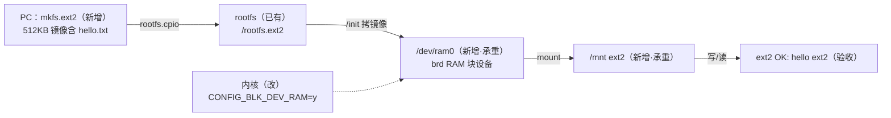

# S4-02 · ext2 真实文件系统（brd RAM 块设备）

> rp2350-linux 移植 · 这份给人看（复盘文，读=复习）；续学接管看上级文件夹 `学习地图.md`。



真板第一次跑**真实文件系统格式**：没有块设备硬件，就用内核 brd 驱动把 RAM 模拟成 `/dev/ram0`；PC 上 `mkfs.ext2` 做镜像，/init 把镜像拷进块设备、`mount` 成 ext2、写读验证。**断电即失**正好演示"非持久化"。

**本阶段拍过的决策**：
- 决策① 文件系统格式 → **ext2 + brd**：内核已内置（EXT2_FS=y）、PC 工具成熟可解剖（mkfs.ext2/e2fsck/debugfs）、结构经典可写、未来可迁真实存储。romfs 只读、squashfs 需压缩块层、jffs2/ubifs 需 MTD 驱动（无 flash 驱动前用不上）。
- 决策② 工程约定 → **bootloader 每关保留**（banner 识别工程 + 改一处不影响别处）；**kernel-Image 只在重编内核时拷贝**（否则复用前关烧录命令）；未变 DTB 复用。

> 第一个钩子：为什么选 ext2 而不是 romfs / squashfs / jffs2？
> <details><summary>参考答案</summary>约束在"载体"不在"格式"：真板没有块设备，flash 要 MTD 驱动。RAM 用 brd 模拟块设备后，格式选内核内置、工具能解剖、可写、结构经典的 ext2；romfs 只读做不了写实验，squashfs 引入压缩/块层，jffs2/ubifs 等有真 flash 驱动再上。</details>

### 第一根枝：brd——把 RAM 当块设备

`CONFIG_BLK_DEV_RAM=y`（brd）+ `BLK_DEV_RAM_SIZE=512`（KB）→ `/dev/ram0`（devtmpfs 提供节点）。brd 是内核的 RAM disk 驱动：内存页池当磁盘，任何块设备操作（读/写/挂载文件系统）都成立，只是断电即失。

### 第二根枝：镜像与挂载

PC 上 `mkfs.ext2 -b 1024 -d <目录> image 512k` 生成 ext2 镜像（预置 hello.txt）；镜像作为 rootfs 里的文件 `/rootfs.ext2` 随分区 2 进内存。`/init` 无 libc 实现：open/read/write 循环把镜像拷进 `/dev/ram0` → `mount("/dev/ram0", "/mnt", "ext2")` → 写/读 `/mnt/test.txt` → 打印 `ext2 OK: hello ext2`。

#### ⚠️ 这一段踩过的小坑
- **函数多了 `_start` 不再保证在 .text 偏移 0**：编译器没把 copy_image/ext2_test 内联，它们排到 _start 前面 → pack-bflt.sh 报错。修复：`_start` 加 `__attribute__((section(".text.start")))` + 链接脚本 `KEEP(*(.text.start))` 放 .text 最前（bFLT entry=64 的前提）。
- **镜像大小受 rootfs 分区约束**：分区 2 只有 1MB，512KB 镜像 + cpio 开销 ≈ 526KB 勉强放下；要更大就扩分区 + `BLK_DEV_RAM_SIZE`。

## 验收（2026-08-28 ✅）

```
S4-02 ext2 on brd
ext2 OK: hello ext2
# 
```

**自测**（盖住答案）
- Q1：为什么选 ext2？
  <details><summary>参考答案</summary>内核内置、工具可解剖、结构经典可写、未来可迁真实存储；romfs 只读、squashfs 复杂、jffs2 需 MTD。</details>
- Q2：brd 是什么？为什么能挂 ext2？
  <details><summary>参考答案</summary>内核 RAM disk 块设备驱动：内存当磁盘，任何块设备操作和文件系统挂载都成立，断电即失。</details>
- Q3：重启后 /mnt 里的 test.txt 还在吗？
  <details><summary>参考答案</summary>不在——brd 是 RAM 盘，数据在重启时清空（非持久化）。</details>
- Q4：镜像怎么进 /dev/ram0？
  <details><summary>参考答案</summary>/init 用 open/read/write 循环把 rootfs 里的 /rootfs.ext2 文件拷进 /dev/ram0。</details>
- Q5（迁移四问）：把根文件系统彻底换成 ext2（不走 initramfs 的 /init）？
  <details><summary>参考答案</summary>bootargs 加 root=/dev/ram0 rootfstype=ext2；DTB linux,initrd-* 继续指向内存镜像但走 legacy initrd（prepare_namespace → initrd_load 拷进 ram0 → mount_root）；坑：root= 解析、legacy initrd deprecated 警告、无 /init 挂载失败 panic；验：内核日志 `VFS: Mounted root (ext2 filesystem)` 实锤。</details>
