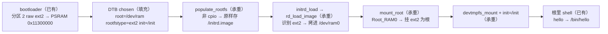

# S4-03 · 根切 ext2（legacy initrd）

> rp2350-linux 移植 · 这份给人看（复盘文，读=复习）；续学接管看上级文件夹 `学习地图.md`。



前两关（S4-01/02）是 initramfs 模型：内核把 cpio 解包进内存根，挂载是 /init 自己干的。本关换成 legacy initrd 老链：分区 2 直接放 raw ext2 镜像，内核认出"这不是 initramfs"，把原始字节存成文件，再由 prepare_namespace 把镜像拷进 /dev/ram0、挂成根、执行根里程序——**挂载这一步从用户态搬回内核态**。

**本阶段拍过的决策**：
- 决策① 镜像怎么进内存 → **bootloader 直接把分区 2 当 raw ext2 拷**：去掉 cpio 包一层——保留 cpio 就还是 initramfs 流程，不是根切。
- 决策② init 程序放哪 → **`init=/init` 显式指定**：不靠 /sbin/init 静默搜索，日志能看到 `Run /init as init process`。
- 决策③ 根设备写法 → **`root=/dev/ram`**：parse_root_device 特判成 Root_RAM0；`root=/dev/ram0` 在 devtmpfs 挂载前查不到节点会解析失败。

> 第一个钩子：cpio 和 ext2 都是一堆字节，内核怎么知道哪个该解包、哪个该挂载？
> <details><summary>参考答案</summary>分两层：populate_rootfs 先按 cpio 解，解得开就是 initramfs；解不开走兜底，把原始字节原样存成 /initrd.image。后面 rd_load_image 按文件系统魔数认格式，mount_root 才真正挂载。识别 ≠ 挂载。</details>

### 第一根枝：populate_rootfs 的兜底——cpio 解不开怎么办

为什么存在：内核拿到 `linux,initrd-start/end` 指的内存，要判断它是 initramfs（cpio 归档，解包到内存根）还是老式 initrd（文件系统镜像，挂载用）。判断靠试：`do_populate_rootfs`（init/initramfs.c）先解内置 initramfs，再对这块内存调 `unpack_to_rootfs` 按 cpio 解。

解得开 = initramfs，文件直接出现在根里；解不开 = 大概率是 initrd。因为 `CONFIG_BLK_DEV_RAM` 开着，内核不丢数据，`populate_initrd_image` 把原始字节**原样写成根里的普通文件 `/initrd.image`**，随后 `Freeing initrd memory: 1024K` 释放那块内存——**rd_load_image 后面读的是文件，不是那块内存**，所以释放发生在文件写完之后，顺序安全。

这个分叉的后果在 init/main.c 接上：初始 rootfs 里没有 /init → `init_eaccess("/init")` 失败 → `ramdisk_execute_command` 被清空 → **`prepare_namespace()` 不再被跳过**，内核自己的根挂载链开跑。S4-02 的 cpio 走左边（跳过 prepare_namespace），本关的 ext2 走右边。

### 第二根枝：initrd_load → rd_load_image——把镜像搬进块设备

`prepare_namespace`（init/do_mounts.c）先按 `root=` 解析根设备，再调 `initrd_load()`（init/do_mounts_initrd.c）：`create_dev("/dev/ram", Root_RAM0)` 造出块设备节点，然后 `rd_load_image()`（init/do_mounts_rd.c）打开 /initrd.image，`identify_ramdisk_image` 按魔数识别：读 block 0 看压缩/romfs/cramfs/squashfs，读 block 1 看 minix/ext2 超级块。认出 ext2 后按 `s_blocks_count` 算出 nblocks（KiB），循环拷进 /dev/ram0（brd）——日志 `RAMDISK: ext2 filesystem found at block 0` + `Loading 512KiB [1 disk] into ram disk... done.`。

这里顺带解释了镜像为什么是 512KB：`BLK_DEV_RAM_SIZE=512` 决定 brd 盘面大小，镜像超过 512KiB 会 `RAMDISK: image too big!`。

### 第三根枝：mount_root——把 /dev/ram0 挂成根

拷完盘，`mount_root(saved_root_name)` 按 `ROOT_DEV` 分派。`root=/dev/ram` 在 `parse_root_device` 里被**特判**成 `Root_RAM0`（ramdisk 主设备 1:0），不需要设备节点存在；`mount_block_root` 造 /dev/root、按 `rootfstype=ext2` 挂载。不给 rootfstype 时 `mount_root_generic` 会拿编译进内核的 bdev 文件系统列表**逐个试**。挂上后打印实锤行 `VFS: Mounted root (ext2 filesystem) readonly on device 1:0.`，接着 `devtmpfs_mount` 挂出 /dev、pivot 进新根，`init=/init` 执行根里程序。

#### ⚠️ 没撞到、但要提前知道的墙
- **root=/dev/ram0 不行**：devtmpfs 在 mount_root 之后才挂，解析时 /dev/ram0 节点不存在，early_lookup_bdev 失败 → ROOT_DEV=0 → 挂载 panic。`/dev/ram` 是内核特判的别名。
- **根默认只读**：`root_mountflags` 默认 MS_RDONLY（fsck 时代的老规矩），本关只读够用；要写根，bootargs 加 `rw`。
- **deprecated 警告**：legacy initrd 计划 2027-01 移除，日志里那行 warning 是预期，不是错。

### 第四根枝：根里 /init 的 stdio——为什么这次要自己 dup3

S4-01/02 的 initramfs 清单里带了 `/dev/console` 节点，`console_on_rootfs()` 能打开，内核自动把 fd 0/1/2 安好。本关初始 rootfs 是**空 ramfs**，没有 /dev/console，`console_on_rootfs()` 打不开（日志 `Warning: unable to open an initial console.`，预期）→ 内核没给 init 建 stdio。于是根里 /init 自己 open /dev/ttyAMA0，再 `dup3(fd, 0/1/2, 0)`（asm-generic 没有 dup2，只有 dup/dup3，dup3 带 flags=0 等价）——子进程 exec 后继承的 fd 1 也指向 tty，hello 的输出才看得见。

另外本关 /init 不再自己挂 devtmpfs：prepare_namespace 正常走了，`devtmpfs_mount()` 由内核完成（日志 `devtmpfs: mounted`）。

## 验收（2026-08-28 ✅）

```
[    2.203404] RAMDISK: ext2 filesystem found at block 0
[    2.203954] RAMDISK: Loading 512KiB [1 disk] into ram disk... done.
[    3.275453] using deprecated initrd support, will be removed in January 2027...
[    3.430710] VFS: Mounted root (ext2 filesystem) readonly on device 1:0.
[    3.446036] devtmpfs: mounted
[    3.447433] VFS: Pivoted into new rootfs
[    3.499110] Run /init as init process
S4-03 root ext2
# hello
Hello, world!
```

**自测**（盖住答案）
- Q1：内核怎么区分 initramfs 和 initrd？
  <details><summary>参考答案</summary>populate_rootfs 先按 cpio 解：解得开 = initramfs（解包进根）；解不开 = initrd，CONFIG_BLK_DEV_RAM 开着就把原始字节原样存成 /initrd.image 文件。</details>
- Q2：为什么 Freeing initrd memory 之后 rd_load_image 还能读到镜像？
  <details><summary>参考答案</summary>populate_initrd_image 先把字节拷成 /initrd.image（ramfs 里的普通文件）再释放内存；rd_load_image 打开的是文件，不依赖那块内存。</details>
- Q3：root=/dev/ram 和 root=/dev/ram0 有什么区别？
  <details><summary>参考答案</summary>/dev/ram 被 parse_root_device 特判成 Root_RAM0，不需要节点存在；/dev/ram0 走 early_lookup_bdev，而 devtmpfs 在 mount_root 之后才挂，解析时节点不存在会失败。</details>
- Q4：为什么本关根里 /init 要自己 dup3 tty，而 S4-01/02 不用？
  <details><summary>参考答案</summary>S4-01/02 的 initramfs 清单自带 /dev/console，console_on_rootfs 能建好 fd 0/1/2；本关初始 rootfs 是空 ramfs，没有 /dev/console，内核没建 stdio，init 只能自己安。</details>
- Q5（迁移四问）：引导器给的镜像格式未知（ext2/romfs/cramfs 之一），bootargs 只有 root=/dev/ram，最少动哪几处？
  <details><summary>参考答案</summary>代码基本不用动——链现成；动配置：CONFIG_BLK_DEV_RAM + BLK_DEV_RAM_SIZE ≥ 镜像，把对应 fs 编进内核（rootfstype 不给时 mount_root_generic 按编译进内核的 bdev fs 列表逐个试）。坑：ram0 解析失败、image too big、初始 rootfs 无 /dev/console、没 init= 且根里没 /sbin/init 会 No working init panic、根默认只读、deprecated 警告。验：`VFS: Mounted root (xxx filesystem) ... on device 1:0.` + Run init + shell 交互。</details>
