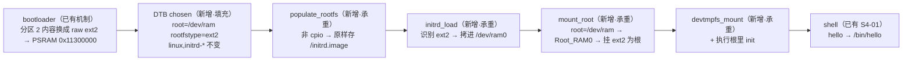

# S4-03 · 根切 ext2（legacy initrd）

> rp2350-linux 移植 · 这份给人看（复盘文，读=复习）；续学接管看上级文件夹 `学习地图.md`。

## 部件图（施工态，通关刷终版）

🚧 本阶段未通关，成文/钩子/自测通关时补。

## 决策清单（问题态：做到对应部件时用户拍板，拍完回填答案与理由）

- 决策① 镜像怎么进内存：bootloader 把分区 2 直接当 raw ext2 拷到约定地址？还是保留 cpio 包一层？
- 决策② 根里 init 程序放哪：/sbin/init（legacy 约定搜索链）？还是 init=/init 显式 bootarg？

## 要点段（承重部件过真机验收后落）

- 未开始。
