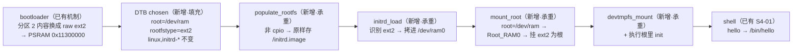

# S4-03 · 根切 ext2（legacy initrd）

> rp2350-linux 移植 · 这份给人看（复盘文，读=复习）；续学接管看上级文件夹 `学习地图.md`。

## 部件图（施工态，通关刷终版）

🚧 本阶段未通关，成文/钩子/自测通关时补。

## 决策清单（已拍，2026-08-28）

- 决策① 镜像怎么进内存 → **bootloader 直接把分区 2 当 raw ext2 拷到 0x11300000**：去掉 cpio 包一层——保留 cpio 就还是 initramfs 流程，不是根切。
- 决策② init 程序放哪 → **`init=/init` 显式指定**：不靠 /sbin/init 静默搜索链，日志里能看到 `Run /init as init process`。
- 决策③ 根设备写法 → **`root=/dev/ram`**（parse_root_device 特判 Root_RAM0）；`root=/dev/ram0` 在 devtmpfs 挂载前查不到节点会解析失败。

## 要点段（承重部件过真机验收后落）

- **2026-08-28 真机一次跑通**。日志标志行（新链全齐）：
  `Trying to unpack rootfs image as initramfs...` → `RAMDISK: ext2 filesystem found at block 0` → `RAMDISK: Loading 512KiB [1 disk] into ram disk... done.` → `using deprecated initrd support...`（预期警告）→ **`VFS: Mounted root (ext2 filesystem) readonly on device 1:0.`**（验收实锤）→ `devtmpfs: mounted` → `VFS: Pivoted into new rootfs` → `Run /init as init process` → `S4-03 root ext2` → `# hello` → `Hello, world!`。
- 观察：**根挂载默认只读**（`root_mountflags` 默认 `MS_RDONLY`），本关只读不影响验收；以后要写根，bootargs 加 `rw`。
- 观察：populate_rootfs 把 initrd 内存原样存成 /initrd.image 后 `Freeing initrd memory: 1024K`——rd_load_image 读的是文件不是内存，链的顺序是对的。
- 工程：`s4/03_root-ext2/` 本地构建 + 真机验收通过（待通关大考）。
