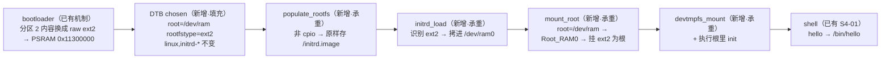

# S4-03 · 根切 ext2（legacy initrd）

> rp2350-linux 移植 · 这份给人看（复盘文，读=复习）；续学接管看上级文件夹 `学习地图.md`。

## 部件图（施工态，通关刷终版）

🚧 本阶段未通关，成文/钩子/自测通关时补。

## 决策清单（已拍，2026-08-28）

- 决策① 镜像怎么进内存 → **bootloader 直接把分区 2 当 raw ext2 拷到 0x11300000**：去掉 cpio 包一层——保留 cpio 就还是 initramfs 流程，不是根切。
- 决策② init 程序放哪 → **`init=/init` 显式指定**：不靠 /sbin/init 静默搜索链，日志里能看到 `Run /init as init process`。
- 决策③ 根设备写法 → **`root=/dev/ram`**（parse_root_device 特判 Root_RAM0）；`root=/dev/ram0` 在 devtmpfs 挂载前查不到节点会解析失败。

## 要点段（承重部件过真机验收后落）

- 工程已建（2026-08-28）：`s4/03_root-ext2/`（bootloader banner/rootfs 命名、DTB bootargs、init.c dup3 安 stdio、hello-src、Makefile/CMake 目标），本地构建全过；**未真机验收**。
