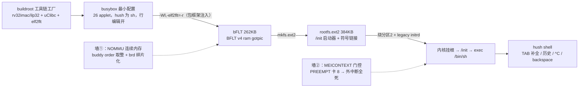

# S4-04 · busybox 移植（riscv32 NOMMU）

> rp2350-linux 移植 · 这份给人看（复盘文，读=复习）；续学接管看上级文件夹 `学习地图.md`。

把真正的 busybox（buildroot 编的 uClibc + bFLT）请上 NOMMU 板子，串口里有了完整 shell。本关跨了三道墙：**NOMMU 连续内存**（大二进制放不下）、**GOTPIC bFLT 首验**（之前手搓的 bFLT 都没 GOTPIC）、**MEICONTEXT 门控**（大输出把外中断静默掐死）。

**本阶段拍过的决策**：
- 工具链 → **buildroot 当"工具链工厂"**（`qemu_riscv32_nommu_virt_defconfig` 裁剪，只留工具链+busybox；已建 git 仓库，首提交无改动 + 我们的 defconfig）。
- ISA/ABI → **rv32imac + ilp32**（QEMU defconfig 默认 imafd/ilp32d 带浮点，Hazard3 无 F/D，必须改 custom 变体）。
- 内存方案 → **先裁 busybox + 缩镜像**（方案 A 扩 ramdisk 到 1MB 只是第一步，真正解决靠 566KB→262KB + 镜像 1MB→384KB）。
- 行编辑 → **开启 FEATURE_EDITING/TAB 补全/历史**（最小化时裁掉了，shell 体验残缺，补回只涨 7KB）。

> 第一个钩子：8MB 内存、账面上还剩 2.6MB，一个 600KB 的分配却失败——为什么？
> 

参考答案
NOMMU 没有页表，分配必须一整块物理连续；buddy 按 2 的幂给块，600KB 请求要 1MB（order-8）整块。2.6MB 剩余被 brd 逐页啃 + page cache 撒芝麻碎成最大 256KB——没有 1MB 块就 -ENOMEM。

### 第一根枝：工具链与 bFLT（两条工具链的分工）

busybox 要 libc，NOMMU 下 libc 只能是 uClibc-ng（musl/glibc 不支持 NOMMU），所以用 buildroot 整套生成 `riscv32-buildroot-linux-uclibc-gcc` + elf2flt。**转换发生在链接时**：buildroot 包框架给 CFLAGS/LDFLAGS 注入 `-Wl,-elf2flt=-r -static`，elf2flt 的 ld 直接把 ELF 转成 bFLT（`BFLT v4 ram gotpic`）。注意：**内部工具链的 gcc wrapper 不会自动加 `-elf2flt`**（那是 external toolchain 的行为）——脱离 buildroot 手编时要自己带这套 flag；我们的 /init 走另一条路（riscv64-linux-gnu-gcc -nostdlib + pack-bflt.sh 手搓无重定位 bFLT）。

坑：QEMU defconfig 的 RISC-V 变体是 G(imafd)/ilp32d（浮点），Hazard3 是 RV32IMAC——必须改 `BR2_riscv_custom` + 关 F/D + 开 C + `ilp32`，否则编出的代码非法指令。busybox 的 `CONFIG_LFS` 被 allnoconfig 关掉但 buildroot CFLAGS 强制 `-D_FILE_OFFSET_BITS=64` → 编译期断言失败，要补开。

#### ⚠️ 这一段踩过的小坑
- `allnoconfig` 后 kconfig 的 choice 会自动选 shell：**ash `depends on !NOMMU`，NOMMU 下 sh 只能是 hush**（之前文档里写的 ash 是错的，已更正）。
- buildroot `busybox.mk` 强制开 `CONFIG_INIT`/hush 特性/MDEV（`KCONFIG_ENABLE_OPT`），配置文件里关不掉，接受即可。

### 第二根枝：NOMMU 连续内存墙（buddy order 与碎片）

每个外部 applet（ls/cat/ps）都是把整份 busybox 当**新进程** exec，flat 加载器把 text+data 当一次匿名 mmap 要（`mm/nommu.c` 按 `get_order(len)` 向上取整整块分配）。旧 566KB busybox 每次要 600KB（order-8 的 1MB 块）；hush 自己占一份后，剩下的 2.6MB 被 brd（1MB 逐页）和 page cache 碎成最大 256KB → 第二个进程 -ENOMEM → 段错误。

解法两步：**裁 busybox**（566KB→262KB，exec 只要 256KB order-6 块）+ **缩镜像**（1MB→384KB，brd 只写 384KB，initrd 释放区留下 512KB 连续块，够两个进程切）。完整账本与修复原理见 [`NOMMU连续内存与分配失败详解.md`](../NOMMU连续内存与分配失败详解.md)。

### 第三根枝：MEICONTEXT 门控坑（本关最深的坑）

大 tty 输出（`cat /proc/meminfo` ~1.5KB）反复触发 shell 假死：输出前半快、后半逐字、然后整条 UART 中断线死掉，但内核活着、驱动状态健康。排查链条（详见学习地图 ⑬-⑱）：计数器显示 Xh3irq handler 干净退出 → 流控全 false、kfifo 空（TX 其实发完了）→ 定时器快照抓到 **MEICONTEXT.PREEMPT 卡在 8** → Xh3irq 按"优先级 ≥ PREEMPT 才允许打断内核"把外部中断全门控了。

根因：S3-03 的 MEICONTEXT 保存/恢复**不完整**——C handler 里恢复 MRETEIRQ=1 后，真正的 mret 要等内核通用 IRQ 退出路径走完，那段有 PSRAM 上的 AMO 锁指令（spinlock）会 fault，模拟器 trap（非 MEIP）清掉 MRETEIRQ → mret 不弹栈 → PREEMPT 卡死。pico-sdk 的软分发把恢复放汇编尾部紧贴 mret，所以没这问题。

修复（内核提交 `d9024611b`）：既然不使能抢占（handler 内 MIE 恒 0），优先级栈深度恒 ≤1——不依赖 mret 弹栈，直接写 MEICONTEXT 的干净态（PREEMPT=0/MRETEIRQ=0/NOIRQ=1）。代价：**"无外中断抢占"变成结构性约束**，将来做 16 级抢占要改成 pico-sdk 式。

#### ⚠️ 这一段踩过的小坑
- **GDB 读 PIE 内核数据符号要加 0x11000000 偏移**（vmlinux 链接基址 0），否则计数器全读 0 假象；`add-symbol-file vmlinux 0x11000000` 或显式地址强转。
- `xmit_fifo` 的字段是嵌套的 `.kfifo.in/.out`，不是 `.in/.out`。
- 内核测试/临时改动不提交（用户拍板）：调试插桩留工作树，验证后清理，正式修复才提交。

### 第四根枝：行编辑

最小化配置把 `FEATURE_EDITING` 裁了，hush 没有自己的行编辑器，TAB 补全没了、Ctrl+C 不取消、backspace 因 tty 默认 erase 是 ^? 而回显 ^H。开回 `FEATURE_EDITING + FEATURE_TAB_COMPLETION + FANCY_PROMPT + HISTORY=50`（buildroot 合并提交 `fdc1291f`，S4-04/S4-05 的 5 笔已合 1），只涨 7KB，shell 体验完整。

## 验收（2026-08-31 ✅）

- GOTPIC bFLT 首验成功：hush shell 起来，外部 applet（ls/cat/echo/uname/ps）正常 exec；
- 反复 `cat /proc/meminfo`（大输出）不再楔死，输出快；
- TAB 补全、历史、^C 取消、backspace 删除、`~ #` 提示符全正常；
- `/proc`、`/sys`（本关末补挂）可用。

**自测**（盖住答案）
- Q1：两条工具链各编什么、bFLT 怎么产生？
  

参考答案
buildroot 工具链（uClibc+elf2flt）编 busybox，包框架注入 `-Wl,-elf2flt=-r` 链接时转 bFLT；/init 等手搓无 libc 程序用系统 gcc + pack-bflt.sh。内部工具链 wrapper 不会自动加 -elf2flt。

- Q2：为什么 8MB 剩余 2.6MB 还分配失败？
  

参考答案
NOMMU 要整块物理连续 + buddy 按 2 的幂给块（600KB→1MB order-8）；2.6MB 被 brd 逐页和 page cache 碎成最大 256KB。

- Q3：MEICONTEXT 门控坑的根因一句话？
  

参考答案
C handler 恢复 MRETEIRQ 后，内核 IRQ 退出路径的 PSRAM AMO fault（非 MEIP trap）清掉 MRETEIRQ → mret 不弹栈 → PREEMPT 卡高 → Xh3irq 按优先级门控掉所有外中断；修复=写干净态不依赖弹栈。

- Q4（迁移四问）：4MB 新板配 busybox，动哪几步？
  

参考答案
buildroot 工具链（rv32imac/ilp32+uClibc+elf2flt）→ 最小 busybox 配置（hush 为 sh、行编辑开）→ bFLT → 打包 ext2（大小受连续内存约束）→ bootloader+legacy initrd 挂根 → /init 启动器 exec sh。坑：浮点 ISA/ABI、LFS 断言、hush 非 ash、内存墙（裁+缩镜像）、MEICONTEXT 门控、GOTPIC 首验。验：外部命令按预期跑、大输出不卡死、shell 不假死。

