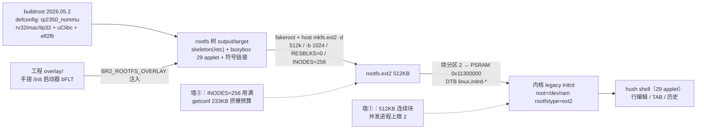

# S4-05 · buildroot 组装 rootfs

> rp2350-linux 移植 · 这份给人看（复盘文，读=复习）；续学接管看上级文件夹 `学习地图.md`。

rootfs 不再手搓 `mkfs.ext2` 打包，改由 **buildroot 组装**（skeleton / 包 / 符号链接 / 权限 / overlay），出 ext2 镜像烧分区 2。为后续把文件系统放上 flash（S5 的 flash/XIP 路线）铺路——同一套 rootfs 基础设施，换载体时只动"烧哪/挂哪"。

**本阶段拍过的决策**：
- rootfs 生成 → **buildroot 组装**（`BR2_TARGET_ROOTFS_EXT2` + `BR2_ROOTFS_OVERLAY`），不再手动 mkfs 打包。
- /init 方案 → **A：overlay 注入手搓启动器**（buildroot 默认树只有 `/sbin/init`，bootargs 是 `init=/init`，必须自己把启动器放进去）。
- busybox applet 集合 → **最终 29 个**：去掉 sed/head/cut/od/date；**insmod/rmmod 去掉**（无 CONFIG_MODULES 内核上 insmod 段错误，S5 做模块时再一起加）；行编辑保持。
- uClibc utils → **关 `BR2_UCLIBC_INSTALL_UTILS`**（getconf 233KB 会挤爆 512KB 预算）。
- ext2 镜像 → **512k / `-b 1024` / `RESBLKS=0` / `INODES=256`**（默认 inode 数装不下 ~110 个文件/符号链接；256 个用满）。
- 内核 → **零改动**（复用 S4-04，sha `2fbb50ab`）；bootloader/DTB/分区约定全部沿用，只有 banner 换成 s4-05。

### 第一根枝：buildroot 的 rootfs 基础设施（"谁管谁"）

buildroot 把选中的包装进 `output/target/`（rootfs 树）：skeleton 包提供 `/etc/{passwd,group,shadow,...}`、`/bin/sh` 符号链接；busybox 的 applet 符号链接（`/bin/ls` → busybox）也是在这里生成的。工程自己的部件（手搓 `/init` 启动器）通过 **`BR2_ROOTFS_OVERLAY`** 指向 `overlay/` 目录，组装时整目录拷进 target。

镜像目标 `BR2_TARGET_ROOTFS_EXT2` 用 **host mkfs.ext2 -d output/target** 出 ext2；文件属主/权限/设备节点靠 **fakeroot** 记进镜像（不需要 root 权限，也保住了 root 属主）。

分工一句话：**buildroot 管"rootfs 内容组装 + 打包"；工程管"自己的部件"（overlay 注入 /init、applet 配置、镜像尺寸预算）；内核管"挂载执行"（legacy initrd 按 DTB 地址把镜像挂成根 → 执行 /init）；bootloader 管"搬运"（分区 2 → PSRAM 约定地址）。**

#### ⚠️ 这一段踩过的小坑
- **inode 用满**：默认 ext2 inode 数装不下 rootfs 树的 ~110 个文件/符号链接，`INODES=256` 后 free=0——以后加文件要调到 384（多占 ~32KB，现余 108KB 够）。
- **残留符号链接**：改 busybox applet 集合后，`output/target` 里旧 applet 的符号链接不会自动清（指向 busybox 会报 applet not found）——手动 `rm` 后重新 `make` 出镜像。
- **getconf 挤爆预算**：uClibc utils 包（getconf 233KB）装进去直接超 512KB，关掉 `BR2_UCLIBC_INSTALL_UTILS`。
- buildroot 宿主环境两个坑（沿用 S4-04）：`PATH` 去掉 Windows 空格路径 + uutils coreutils 的 `install` 被硬拒（用 `/tmp/brhostbin/install -> /usr/bin/gnuinstall` 绕过）。
- 配置变更要 `make clean` / 对包 `dirclean` 重编，否则旧的构建残留会混进来。

### 第二根枝：内存墙边界（本关实测，延续 S4-04）

512KB 镜像 → brd 写 512KB → initrd 释放区留 **512KB 连续块** → 正好装 **2 个 256KB（order-6）busybox 进程**（hush + 1 个外部命令）。

- **并发进程上限 = 2**：管道含 2+ 外部命令（如 `dmesg | tail -10` = hush+dmesg+tail 三个进程）第 3 个 exec 分配失败 → 段错误。
- 绕过：顺序执行（`dmesg > /tmp/d && tail -10 /tmp/d`）。
- `insmod` 段错误同因（当时空闲块更小），applet 已去。
- 要 3 进程需 ≥768KB 连续块 → 靠 S5 的 XIP / 内核瘦身 / flash 路线。

完整账本与 buddy order 原理见 [`NOMMU连续内存与分配失败详解.md`](../NOMMU连续内存与分配失败详解.md) 与学习地图 ⑲。

## 验收（2026-08-31 ✅）

- bootloader banner `=== s4-05 buildroot-rootfs bootloader ===` → 内核 legacy initrd 链（`RAMDISK: ext2 filesystem found` → `VFS: Mounted root (ext2 filesystem)` → `Run /init`）→ /init 启动器 → hush 提示符；
- `ls /etc`（buildroot skeleton 在：passwd/group/shadow 等）、`ls /sys /proc`、`uname -a`、行编辑（TAB/历史/^C/backspace）正常；
- 已知边界按预期复现（并发上限 2、管道 2+ 外部命令段错误、顺序重定向绕过）。

**自测**（盖住答案）
- Q1：buildroot 组装 rootfs 与手搓 mkfs.ext2 相比，链上动了哪些部件？
  

参考答案
内核/DTB/bootloader 全不动（内核复用 S4-04，地址约定不变）；动的是 rootfs 生产链：工程 Makefile 加 rootfs 目标 + overlay 注入 /init + buildroot 配置（skeleton/包/applet/ext2 目标/fakeroot）出镜像。新板子场景才要动 DTB initrd 地址/内存参数。

- Q2：组装时"谁管谁"？
  

参考答案
buildroot 管 rootfs 内容组装与打包（skeleton、applet 符号链接、权限、mkfs.ext2）；工程管自己的部件（overlay 注入 /init、busybox applet 集合、镜像尺寸预算）；内核管挂载执行（legacy initrd）；bootloader 管搬运。

- Q3：会踩哪些坑？
  

参考答案
内存墙具体形态（并发上限 2 / 512KB 连续块 / 管道 2+ 外部命令段错误 / 绕过=顺序重定向）；inode 用满（INODES=256，加文件调 384）；getconf 233KB 挤爆预算（关 BR2_UCLIBC_INSTALL_UTILS）；改 applet 后 output/target 残留符号链接要手动 rm；配置变更要 clean/dirclean；宿主 PATH 空格 + uutils install 坑。

- Q4（迁移四问）：怎么验收"buildroot rootfs 真的成功了"？
  

参考答案
内核挂载实锤行 `VFS: Mounted root (ext2 filesystem)` + `Run /init`；交互验收：`ls /etc` 看到 buildroot skeleton、`uname -a`/`echo` 等外部 applet 能 exec、行编辑正常、已知边界不咬人（顺序执行绕过验证）。

## 大考批改（2026-08-31）

考法：迁移四问——新板子（4MB、同核）rootfs 直接用 buildroot 组装。用户答：

1. "设备树的 initrd start end 地址可以调整一下。内核的配置不需要动，因为相关配置已经开启了。" → **后半对**（本关内核确实零改动，复用 S4-04）；**前半偏**：DTB 地址是"新板子的参数"，本关实际没动 DTB——真正动的是 rootfs 生产链（buildroot 组装 + overlay + Makefile 目标）。判断虚。
2. "内核在指定的地址挂载文件系统，buildroot 负责编译生成文件系统并使用 mkfs.ext2 打包，我们的 bootloader 负责拷贝加载各个部分。" → **三方分工粗粒度全对**；缺一角：工程自己管 overlay 注入 /init（以及 applet 配置、尺寸预算）。形状偏实，漏 overlay 角。
3. "内存不够用的问题，即使经过裁剪，也会出现内存不够的问题；buildroot busybox 配置修改时需要先 clean 不然会有旧的残留。" → **内存墙抓到**（本关最大坑）；但只说"内存不够"，没给具体形态（并发上限 2 / 512KB 连续块 / 管道 3 进程段错误 / 绕过）；"残留"机制讲反了一点（残留的是 output/target 旧符号链接，clean/dirclean 是配置变更的另一回事）。漏 getconf、inode 用满。偏实但泛。
4. "/etc 结构在，busybox banner" → **"/etc 结构在"是 buildroot skeleton 的实锤证据**（好）；但缺两个更硬的：内核挂载行 `VFS: Mounted root (ext2 filesystem)` 和交互验收（敲命令 / 外部 applet exec）。验收虚。

**认知模型地图**：
- ✅ 内核配置不动（Q1）；三方分工（Q2）；内存墙是最大坑（Q3）；/etc 结构 = buildroot 痕迹（Q4）。
- 🔶 判断虚：本关动的其实是 rootfs 生产链，不是 DTB 地址参数 → 检验点：S5 flash/XIP 路线（地址/载体真正要动）。
- 🔶 形状虚：overlay 注入 /init 这一角 → 检验点：S5 换载体/加包时还要碰 overlay。
- 🔶 定位虚：坑的具体形态（并发上限 2、inode 用满、getconf、残留符号链接机制）→ 检验点：S5 busybox 精细裁剪。
- 🔶 验收虚：挂载实锤行 + 交互验收 → 检验点：S5 换 rootfs 载体时再验。

## 遗留小事

- `s4/05_buildroot-rootfs/initramfs-src/init.c` 的 banner 字符串还是 `"S4-04 busybox\n"`（从 S4-04 拷来没改）；bootloader banner 已是 s4-05。要改就 init.c 一行 + 重新 `make init-s4-05 rootfs-s4-05` 出镜像，重烧 rootfs 分区。
