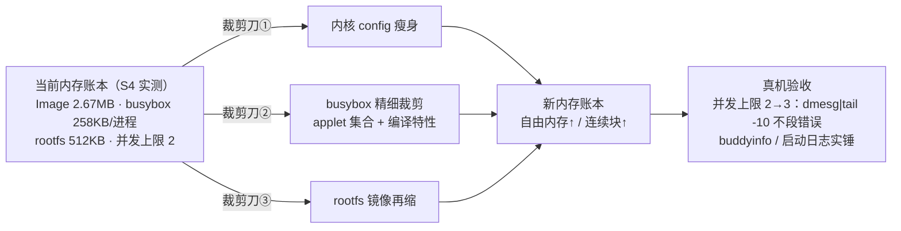

# S5-00 · 裁剪优化①：RAM 路线轻量化

> rp2350-linux 移植 · 这份给人看（复盘文，读=复习）；续学接管看上级文件夹 `学习地图.md`。

## 施工态区（开工部件图 · 2026-08-31）

**起点（bootloader）**：s4-05 版 + 225MHz 超频（用户手改）：`vreg_disable_voltage_limit()` + 1.20V + `set_sys_clock_khz(225000)`，clk_peri 跟 clk_sys（225MHz）；日志精简（copy done/校验成功不打印，**校验保留只报错**——225MHz 下 flash/PSRAM 时序是唯一真风险）。串口 divisor 由 pico-sdk 按现 clk_peri 现算，仍 115200；内核 earlycon/sbsa 不重算 divisor，DT 无需改。

## 决策层（开工只列问题，到对应部件再拍）

- D1（busybox 部件）：精细裁剪底线——保留哪些 applet？258KB/进程 目标砍到多少（3 进程预算 ≈ ≤200KB/进程）？
- D2（内核部件）：内核瘦身目标尺寸（2.67MB → ？）；功能底线（调试 / console / 文件系统 / 网络哪些必须留）？
- D3（验收部件）：本关验收线 = 并发上限 2→3 + 内存账本实锤，够不够？

## 承重部件要点（施工中落）

### 裁剪刀①：内核 config 瘦身（2026-08-31 ✅ 编译，待真机验证）

- **砍掉**：`SERIAL_8250`（~30KB）、`VIRTIO_*`（core/blk/mmio/anchor ~25KB）、`SG_POOL`（virtio_blk 带入）、`MSDOS/EFI_PARTITION`（~10KB，注意 `# CONFIG_MSDOS_PARTITION is not set` 对隐藏符号不生效，必须 `PARTITION_ADVANCED=y` + 显式关才能真去掉）。
- **保留**：PL011/sbsa console、VT、INPUT、RP2350 timer/xh3irq、ext2/brd/initrd、ARCH_VIRT（其 select 的 GOLDFISH/POWER_RESET 很小，留着）。
- **结果**：Image 2,801,576 → **2,737,296**（-64KB，2.3%）；Image.gz 1,387,495 → 1,351,015。
- **结论**：config 瘦身空间有限（内核 text 1.66MB 是 mm/fs/tty 本体）；**flash 大头靠 Image.gz（压缩率 ~50%）**。
- **剩余候选（待用户审）**：PLIC/APLIC/IMSIC/MSI/CLINT 等未用中断/定时器驱动 ~20KB（DT 无节点不会 probe，可安全砍）；VT/INPUT 用户已拍保留。

## 验收

（待验收）
