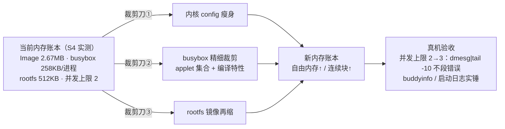

# S5-00 · 裁剪优化①：RAM 路线轻量化

> rp2350-linux 移植 · 这份给人看（复盘文，读=复习）；续学接管看上级文件夹 `学习地图.md`。

## 施工态区（开工部件图 · 2026-08-31）

**起点（bootloader）**：s4-05 版 + 225MHz 超频（用户手改）：`vreg_disable_voltage_limit()` + 1.20V + `set_sys_clock_khz(225000)`，clk_peri 跟 clk_sys（225MHz）；日志精简（copy done/校验成功不打印，**校验保留只报错**——225MHz 下 flash/PSRAM 时序是唯一真风险）。串口 divisor 由 pico-sdk 按现 clk_peri 现算，仍 115200；内核 earlycon/sbsa 不重算 divisor，DT 无需改。

## 决策层（开工只列问题，到对应部件再拍）

- D1（busybox 部件）：精细裁剪底线——保留哪些 applet？258KB/进程 目标砍到多少（3 进程预算 ≈ ≤200KB/进程）？
- D2（内核部件）：内核瘦身目标尺寸（2.67MB → ？）；功能底线（调试 / console / 文件系统 / 网络哪些必须留）？
- D3（验收部件）：本关验收线 = 并发上限 2→3 + 内存账本实锤，够不够？

## 承重部件要点（施工中落）

### 裁剪刀①：内核 config 瘦身（2026-08-31 ✅ 编译，待真机验证）

- **第一刀（2026-08-31）**：砍 `SERIAL_8250`（~30KB）、`VIRTIO_*`（~25KB）、`SG_POOL`、`MSDOS/EFI_PARTITION`（~10KB）→ Image 2.80→2.74MB。坑：**隐藏符号的 `# is not set` 不生效**（PARTITION_ADVANCED=n 时 MSDOS/EFI 仍是 default y），必须 `PARTITION_ADVANCED=y` + 显式关。
- **第二刀（用户拍板 rootfs 切 cpio）**：**整个 BLOCK 层关掉**（`# CONFIG_BLOCK is not set`）→ ext2/brd/分区解析全消失（text -253KB）；`RISCV_APLIC/RISCV_IMSIC/SIFIVE_PLIC` 是 **arch 无条件 select**，defconfig 关不掉 → 动 `arch/riscv/Kconfig` 删 3 个 select（~18KB）。
- **CLINT_TIMER 不能关（新坑）**：M 模式 arch `asm/timex.h` 的 `get_cycles64` 无条件引用 `clint_time_val`（定义在 timer-clint.c）；关掉后 `nm vmlinux` 显示 **U clint_time_val** + CHKREL bad relocation，rp2350 驱动 probe 时对地址 0 赋值必崩。保留（2.3KB）让 timer-clint.o 提供符号，rp2350 驱动继续接管赋值。
- **结果**：Image 2,801,576 → **2,511,040**（-290KB，10.4%）；Image.gz → **1,226,042**。
- **rootfs 机制翻案（用户拍板）**：legacy initrd + ext2 on brd 整套退役，切回 **cpio initramfs**（buildroot `BR2_TARGET_ROOTFS_CPIO`，315KB）；DTB bootargs 去 root=/dev/ram rootfstype=ext2；ext2/brd/BLOCK 等配置 S5-02 flash 路线再开。buildroot 提交点（格式切换）。
- **结论**：BLOCK 层 + 未用中断控制器是最大头；**flash 空间大头靠 Image.gz（压缩率 ~50%）**，bootloader 解压下一步做。

## 验收

（待验收）
