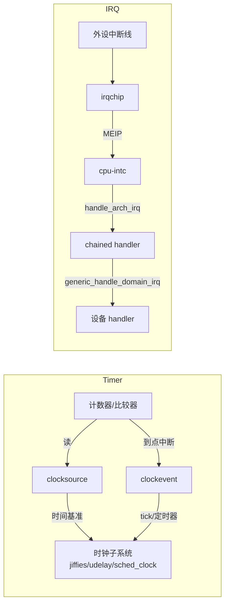

# 平台移植手记：写 timer 与 irqchip 驱动

> 把 Linux 移植到一块全新平台（新 SoC/新板子）时，`drivers/clocksource/` 和 `drivers/irqchip/` 通常是你最先要写、也最绕不开的两个驱动。本文用本项目 RP2350 的实战经验，讲清**怎么写、驱动里做什么、为什么这么做、提供了哪些功能、和内核哪些接口怎么配合**。
> 案例细节：`timer-rp2350.c`（S3-02）、`irq-rp2350-xh3irq.c`（S3-03）；配套复盘见对应学习记录。

## 0. 先建立两个心智模型

**定时器 = 两个角色**：内核的时间需求其实分两种——"现在几点"（读计数）和"到点叫我"（定闹钟）。对应两个内核对象：

| 角色 | 内核对象 | 类比 | 硬件对应 |
|---|---|---|---|
| 读时间 | `clocksource` | 手表 | 计数器（只读） |
| 定闹钟 | `clockevent` | 闹钟 | 比较器（可写，到点触发中断） |

**中断 = 两级**：外设的中断线通常不直接进 CPU，而是先进一个"外部中断控制器"（irqchip），再聚合到 CPU 的某条本地中断线（RISC-V 上是 MEIP/MTIP 等），由 `handle_arch_irq` 分发。所以写 irqchip 驱动 = 写一个"翻译官"：硬件中断号 ↔ Linux 虚拟中断号。



## 0.5 移植早期的最小顺序（先做什么）

earlycon / timer / irqchip 是移植早期的核心，但**不是并列的，有依赖关系**，按启动时序排：

1. **`riscv,cpu-intc`（最小的 irqchip）最优先**：`init_IRQ()` 启动很早就要 `handle_arch_irq` 非空，否则直接 panic "No interrupt controller found."。它是内核自带驱动，DTB 加节点即可，零代码。这是中断基础设施的最小条件。
2. **earlycon**：严格说不是驱动，是启动参数（`earlycon=pl011,mmio32,...`）直接激活的早期控制台：绕过驱动框架、MMIO 直写 UART。没有它，内核早期任何问题都是静默的。
3. **timer（clocksource/clockevent）**：`time_init()` 在 `init_IRQ()` 之后不久需要时间（printk 时间戳 / udelay / jiffies）。**注意 timer 只依赖 cpu-intc（MTIP 直连），不依赖外部 irqchip**——所以它应该、也可以先做。
4. **外部 irqchip（PLIC / 自定义）**：只有外设需要中断时才要（UART RX、GPIO、DMA…）。纯定时器阶段用不上。

最省事的顺序：**cpu-intc（DTB 一行）→ earlycon（bootargs 一行）→ timer 驱动 → 外部 irqchip 驱动**，每步只加一个变量，出问题好定位。本项目正是 S3-01（earlycon）→ S3-02（cpu-intc + timer）→ S3-03（外部 irqchip Xh3irq）的顺序。比喻：earlycon 是"眼睛"，timer 是"心跳"，irqchip 是"神经"（cpu-intc 是神经的最小骨架，外部 irqchip 是完整网络）。

## 1. 动手前：摸清新平台要回答的问题

写代码前先读手册，把答案记下来（这些决定驱动怎么写）：

**定时器**：
- 计数器在哪（MMIO 地址/CSR）、多宽（32/64 位）、怎么安全读 64 位（防翻转）；
- 频率从哪来（外部晶振/内部 PLL/tick 发生器）——**是否随 CPU 频率变化**（决定 timebase 能不能写死）；
- 比较器几个、per-core 还是共享、**写入有没有协议要求**（顺序错了会假中断）；
- 中断怎么到核：直连标准 MTIP，还是走外部 irqchip。

**中断控制器**：
- 标准（PLIC/APLIC/ITS）还是自定义（如 RP2350 的 Xh3irq）——标准的有现成驱动；
- enable/pending/优先级怎么操作（MMIO 寄存器 or CSR 数组）；
- 怎么"取下一个中断"（PLIC 是 claim 寄存器，Xh3irq 是 MEINEXT CSR）；
- 聚合到核的哪条线（RISC-V 一般是 MEIP，cause 11）。

## 2. timer 驱动：两个角色，一个文件

### 功能与职责

```c
static u64 rp2350_get_cycles64(void) { ... }        /* 读计数器（防翻转重读高半） */
static u64 rp2350_clocksource_read(struct clocksource *cs)
{
	return rp2350_get_cycles64();
}

static int rp2350_clock_next_event(unsigned long delta,
				   struct clock_event_device *ce)
{
	/* 按手册序列写比较器（全 1 → 高半 → 低半） */
	csr_set(CSR_IE, IE_TIE);          /* 关-开配对里的"开" */
	return 0;
}
```

- **clocksource 角色**：实现一个"读当前时间"的回调，注册后内核用它做时间基准（`clocksource_register_hz`）和 sched_clock（打印日志的时间戳来源）；
- **clockevent 角色**：实现"设定下一次到期"（`set_next_event`）+ 一个中断处理函数（到点后调 `event_handler`），注册后内核用它跑 jiffies/tick/定时器。

### 为什么是这两个角色

内核把"读"和"闹钟"分开抽象，因为硬件可以分开（很多 SoC 计数器一个、比较器另配），也因为用途不同（读要低延迟高精度，闹钟要能改期）。移植者只要把硬件能力映射到这两个角色，内核的时间子系统自动接管。

### probe 里按顺序做这几件事

1. `of_iomap` 映射寄存器（或直接地址）；
2. 确认/启动时钟源（RP2350 是 tick generator，驱动兜底启动）；
3. `clocksource_register_hz(&cs, freq)`——注册手表；
4. `sched_clock_register(read, 64, freq)`——让日志时间戳动起来；
5. `request_percpu_irq(timer_irq, handler, ...)` + `enable_percpu_irq`——注册闹钟中断（**必须 percpu**，见坑 3）；
6. `clockevents_config_and_register(ce, freq, min, max)`——注册闹钟。

### 中断处理函数（闹钟响了）

```c
static irqreturn_t rp2350_timer_interrupt(int irq, void *dev_id)
{
	struct clock_event_device *evdev = this_cpu_ptr(&rp2350_clock_event);

	csr_clear(CSR_IE, IE_TIE);      /* 关铃：电平中断防重入 */
	evdev->event_handler(evdev);    /* 喊内核：到点了 */
	return IRQ_HANDLED;
}
```

先关中断使能位（电平 pending 期间不重入），再调内核注册的回调（它负责 jiffies/定时器），下次 `set_next_event` 再打开。详见 S3-02 学习记录"clockevent 的闹钟循环"。

### 常见坑（S3-02 实战）

1. **不能改现成驱动的偏移**（如 SiFive CLINT）：偏移写死在公共驱动里，改了就破坏其他平台——新写专用驱动；
2. **比较器写入顺序**：`writeq` 低→高会假中断，按手册序列写；
3. **cpu-intc 的中断全是 percpu**：必须 `request_percpu_irq` + per-cpu clockevent，普通 `request_irq` 会卡/崩；
4. **`timebase-frequency` 必须匹配真实频率**，且选与可变 CPU 频率解耦的时钟源（RP2350 用 1MHz tick，不绑 sys_clk）。

## 3. irqchip 驱动：翻译官 + 分发器

### 功能与职责

```c
static struct irq_domain *xh3irq_domain;

static void xh3irq_irq_mask(struct irq_data *d)   { /* 清 enable 数组对应位 */ }
static void xh3irq_irq_unmask(struct irq_data *d) { /* 置 enable 数组对应位 */ }

static void xh3irq_handle_irq(struct irq_desc *desc)
{
	chained_irq_enter(chip, desc);
	while (1) {
		next = csr_read_set(MEINEXT, UPDATE);   /* 取下一个中断 */
		if (next & NOIRQ) break;
		irq = next >> 2;
		generic_handle_domain_irq(xh3irq_domain, irq);  /* 分发 */
	}
	chained_irq_exit(chip, desc);
}
```

- **irq domain**：维护"硬件中断号 ↔ Linux 虚拟中断号"的映射，设备驱动 `request_irq` 时通过它找到正确的中断；
- **chip 回调**：mask/unmask（读写 enable 数组/寄存器）——内核开关中断时调用；
- **chained handler**：挂在父中断（如 cpu-intc 的 MEIP）上的分发器，中断来了循环取"下一个待处理中断"，逐个 `generic_handle_domain_irq` 发给对应设备。

### 为什么需要这些

Linux 的中断子系统不知道你的硬件长什么样，它只认"irq domain + irq chip + handler"这套抽象。你的工作就是把硬件的 enable/pending/取中断逻辑翻译成这套接口：

| 内核接口 | 你的实现负责 |
|---|---|
| `irq_domain_add_linear` | 建映射表（多少个硬件中断） |
| `irq_domain_ops.map` | 绑定 chip/handler 到每个中断 |
| `irq_chip.irq_mask/unmask` | 开关某条中断线 |
| `irq_set_chained_handler_and_data` | 把分发器挂到父中断 |
| `generic_handle_domain_irq` | 把具体中断分发给设备 |

### 两个必须做的防护（RP2350 实战教训）

1. **启动时清空 enable 数组**：硬件复位后 enable 位可能不是全 0（幽灵位），会让复位就 assert 的中断源直接风暴；
2. **分发时无 handler 的中断直接 mask**：电平型源在 handler 清源前一直 pending，没人处理就死循环。

## 4. DTB：连接硬件与驱动的胶水

驱动靠 `compatible` 字符串匹配设备树节点，节点描述硬件在哪、中断怎么连：

```dts
timer@d0000000 {
	compatible = "raspberrypi,rp2350-timer";
	reg = <0xd0000000 0x1000>;
	interrupts-extended = <&cpu_intc 7>;   /* 7 = MTIP */
};

xh3irq: interrupt-controller {
	compatible = "raspberrypi,rp2350-xh3irq";
	interrupt-controller;
	#interrupt-cells = <1>;
	interrupts-extended = <&cpu_intc 11>;  /* 11 = MEIP */
};

uart@40070000 {
	compatible = "arm,sbsa-uart";
	interrupts-extended = <&xh3irq 33>;    /* 外设中断挂到 xh3irq */
};
```

注意：**驱动注册用的是 `TIMER_OF_DECLARE` / `IRQCHIP_DECLARE` 宏**，内核在启动早期（`timer_probe()` / `irqchip_init()`）自动按 DT 节点匹配并调用你的 init 函数——不需要手动注册。

## 5. 最小验证路径（怎么证明驱动对了）

**timer**：
1. 日志出现 `timer running at X Hz`（probe 成功）；
2. 日志时间戳开始推进（sched_clock 活了）；
3. `calibrate_delay ... lpj=NNNN` 出现（udelay 有真实时间）；
4. `init_IRQ` 不再 panic、启动推进到下一个断点。

**irqchip**：
1. 日志出现 `N external interrupts mapped`（domain 建好）；
2. 用 force 位/软件触发一个中断，确认走到 handler（输出可见标记）；
3. 真实外设中断能进设备驱动（S6 有用户空间后更直观）。

## 6. 本项目案例速查

| 内容 | 文件 | 关键点 |
|---|---|---|
| timer 驱动 | `linux-7.2/drivers/clocksource/timer-rp2350.c` | 1MHz tick 与 sys_clk 解耦、MTIMECMP 写序列、percpu irq |
| irqchip 驱动 | `linux-7.2/drivers/irqchip/irq-rp2350-xh3irq.c` | CSR 数组（MEIEA/MEINEXT）、chained handler、MEIEA 清零 + 无 handler 防风暴 |
| 时序 | S3-02/S3-03 学习记录 | init_IRQ(cpu-intc) → time_init(timer) → do_initcalls(sbsa probe + irq 使用) |

一句话总结：**timer 驱动回答"时间从哪读、到点怎么叫"，irqchip 驱动回答"外设中断怎么进来、分给谁"；两者都靠 DTB 描述硬件、靠 `*_OF_DECLARE` 注册、把能力翻译成内核的抽象接口，剩下的由内核子系统接管。**
